# 扩展 - AI 应用开发新范式 MCP 技术详解


[TOC]


## 第一章 MCP（模型上下文协议）：连接大模型和外部世界的 USB-C 接口


MCP（模型上下文协议）最近比较火， 正在逐渐成为智能体（Agent）与外部交互的标准协议。MCP 最初是由 Anthropic 公司发起的一个项目，旨在让像 Claude 这样的 AI 模型更轻松地与工具和数据源进行交互。如今，MCP 已经不再仅仅是 Anthropic 的项目。**MCP 是一个开放的协议，一种 AI 应用开发的新范式**，越来越多的公司和开发者正在加入其中。


**介绍 MCP 协议的相关概念、架构、优缺点、应用场景。**


### 1.1 什么是 MCP

**MCP（Model Context Protocol，模型上下文协议）**是一种开放协议，旨在实现大型语言模型（LLM） 应用与外部数据源、工具和服务之间的无缝集成，类似于网络中的 HTTP 协议或邮件中的 SMTP 协议。

可以将 MCP 想象成智能体应用程序的 USB-C 接口，它为连接 AI 模型与不同的数据源和工具提供了标准化的方法。

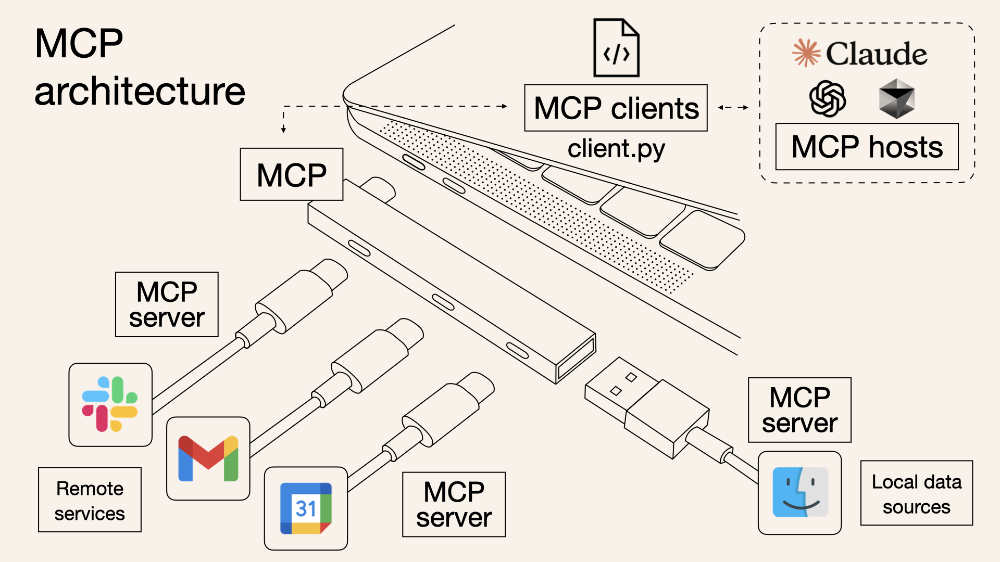

### 1.2 为什么需要 MCP

传统的做法，将 AI 系统连接到外部工具需要集成多个 API。每个 API 的集成意味着单独的代码、文档、身份验证方法、错误处理和维护工作。

#### 1.2.1 传统 API 像每扇门各自的钥匙

从比喻的角度来说：APIs 就像一扇扇独立的门——每扇门都有自己的钥匙和规则：

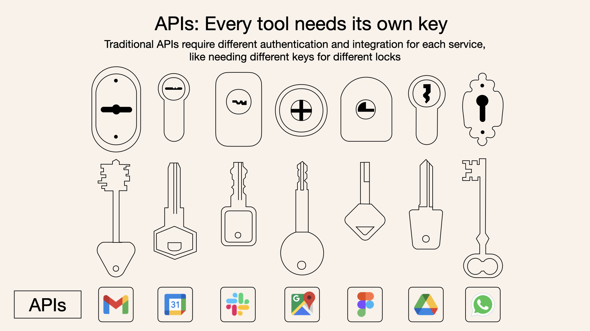

传统 API 要求开发者为每个服务或数据源进行集成开发。

#### 1.2.2 MCP VS 传统 API

| **特性**       | **MCP**            | **传统 API**            |
| :------------- | :----------------- | :---------------------- |
| 集成开发工作量 | 单一、标准化的集成 | 每个 API 都需要单独集成 |
| 实时通信       | ✅ 是               | ❌ 否                    |
| 动态发现       | ✅ 是               | ❌ 否                    |
| 可扩展性       | 容易（即插即用）   | 需要额外的集成开发      |
| 安全性和控制   | 在工具间保持一致   | 因 API 而异             |

**MCP 和传统 API 的主要区别**：

- **单一协议**：MCP 作为一种标准化的“连接器”，意味着集成一个 MCP 就有可能访问多个工具和服务，而不仅仅是一个。
- **动态发现**：MCP 允许 AI 模型动态地发现可用的工具并与之交互，无需对每个集成进行硬编码。
- **双向通信**：MCP 支持持久化的、实时的双向通信——类似于 WebSockets。AI 模型可以动态地检索信息和触发动作。


### 1.3 总体架构

MCP 的核心遵循客户端-服务器架构，其中 host 应用程序可以连接到多个服务器：

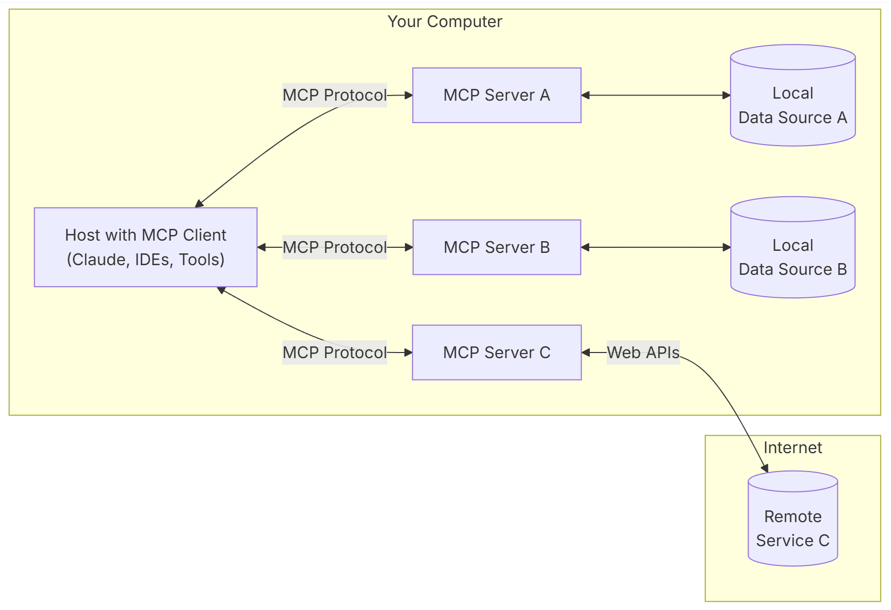

- **MCP 主机**：像 Claude 桌面、IDE 或 AI 工具等应用程序，这些应用程序需要通过 MCP 访问外部数据。
- **MCP 客户端**：保持与服务端 1:1 连接的协议客户端 。
- **MCP 服务端**：通过标准化的 MCP（模型上下文协议）暴露特定功能的轻量级程序 。
- **本地数据源**：MCP 服务端可以安全访问的计算机文件、数据库和服务 。
- **远程服务**：通过互联网（例如，通过 API）可访问的外部系统，MCP 服务端可以连接到这些系统。

将 MCP 视作一座桥梁，可以清晰地看到：MCP 本身并不处理繁重的逻辑。MCP 只是简单地协调 AI 模型与工具之间的数据和指令流动。

MCP 服务端可以提供三种主要类型的功能：

- **资源**：可以被客户端读取的类似文件的数据（如 API 响应或文件内容）
- **工具**：LLM 可以调用的外部功能。
- **提示**：帮助用户完成特定任务的预写模板。


### 1.4 MCP 消息协议 JSON-RPC 2.0

在MCP中规定了唯一的标准消息格式，就是 **JSON-RPC 2.0**

JSON-RPC 2.0是一种轻量级的、用于远程过程调用（RPC）的消息交换协议，使用JSON作为数据格式

**注意：** 它不是一个底层通信协议，只是一个应用层的消息格式标准。这种消息协议的好处，与语言无关（还有语言不支持JSON吗）、简单易用（结构简单，天然可读，易于调试）、轻量灵活（可以适配各种传输方式）


### 1.5 MCP传输协议

#### 1.5.1 STDIO模式(本地测试)

STDIO（Standard Input/Output）是一种基于标准输入（stdin）和标准输出（stdout）的本地通信方式

MCP Client启动一个子进程（MCP Server）并通过stdin和stdout交换JSON-RPC消息来实现通信

其基本通信过程如下：

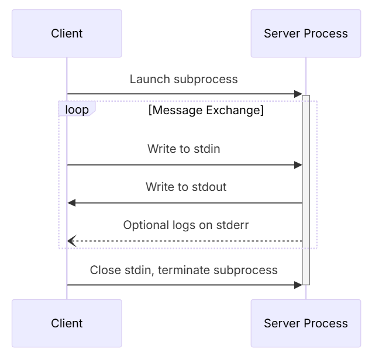

**详细描述如下:**

1. **启动子进程（MCP Server）**

   - MCP Client以子进程形式启动MCP Server，通过命令行指定Server的可执行文件及其参数

2. **消息交换**

   - MCP Client通过stdin向MCP Server写入JSON-RPC消息

   - MCP Server处理请求后，通过stdout返回JSON-RPC消息，也可通过stderr输出日志

3. **生命周期管理**

   - MCP Client控制子进程(MCP Server)的启动和关闭。通信结束后，MCP Client关闭stdin，终止MCP Server

#### 1.5.2 SSE模式

SSE（服务器发送事件）是一种基于HTTP协议的单向通信技术，允许Server主动实时向Client推送消息，Client只需建立一次连接即可持续接收消息。它的特点是:

- 单向（仅Server → Client）
- 基于HTTP协议，一般借助一次HTTP Get请求建立连接
- 适合实时消息推送场景（如进度更新、实时数据流等）

由于SSE是一种单向通信的模式，所以它需要配合HTTP Post来实现Client与Server的双向通信

严格的说，这是一种HTTP Post（Client->Server）+ HTTP SSE（Server -> Client）的伪双工通信模式

**这种传输模式下:**

- 一个HTTP Post通道，用于Client发送请求。比如调用MCP Server中的Tools并传递参数。注意，此时Server会立即返回
- 一个HTTP SSE通道，用于Server推送数据，比如返回调用结果或更新进度
- 两个通道通过session_id来关联，而请求与响应则通过消息中的id来对应

**其基本通信过程如下:**

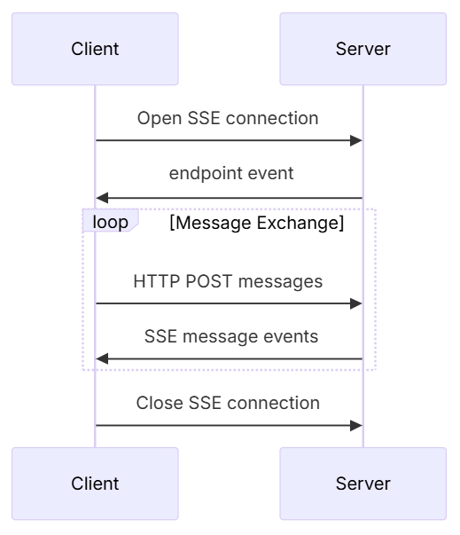

**详细描述如下:**

1. **连接建立：** Client首先请求建立 SSE 连接，Server“同意”，然后生成并推送唯一的Session ID
2. **请求发送：** Client通过 HTTP POST 发送 JSON-RPC2.0 请求（请求中会带有Session ID 和Request ID信息）
3. **请求接收确认：** Server接收请求后立即返回 202(Accepted)状态码，表示已接受请求
4. **异步处理：** Server应用框架会自动处理请求，根据请求中的参数，决定调用某个工具或资源
5. **结果推送：** 处理完成后，Server通过 SSE 通道推送 JSON-RPC2.0 响应，其中带有对应的Request ID
6. **结果匹配：** Client的SSE连接侦听接收到数据流后，会根据Request ID 将接收到的响应与之前的请求匹配
7. **重复处理：** 循环2-6这个过程。这里面包含一个MCP的初始化过程
8. **连接断开：** 在Client完成所有请求后，可以选择断开SSE连接，会话结束

简单总结：通过HTTP Post发送请求，但通过SSE的长连接异步获得Server的响应结果

#### 1.5.3 Streamable HTTP模式

在MCP新标准（2025-03-26版）中，MCP引入了新的Streamable HTTP远程传输机制来代替之前的HTTP+SSE的远程传输模式，STDIO的本地模式不变

该新标准还在OAuth2.1的授权框架、JSON-RPC批处理、增强工具注解等方面进行增加和调整，且在2025.05.08号发布的MCP SDK 1.8.0版本中正式支持了Streamable HTTP

**HTTP+SSE这种方式存在问题有：**

- 需要维护两个独立的连接端点
- 有较高的连接可靠性要求。一旦SSE连接断开，Client无法自动恢复，需要重新建立新连接，导致上下文丢失
- Server必须为每个Client维持一个高可用长连接，对可用性和伸缩性提出挑战
- 强制所有Server向Client的消息都经由SSE单向推送，缺乏灵活性

**其主要变化部分的基本通信过程如下：**

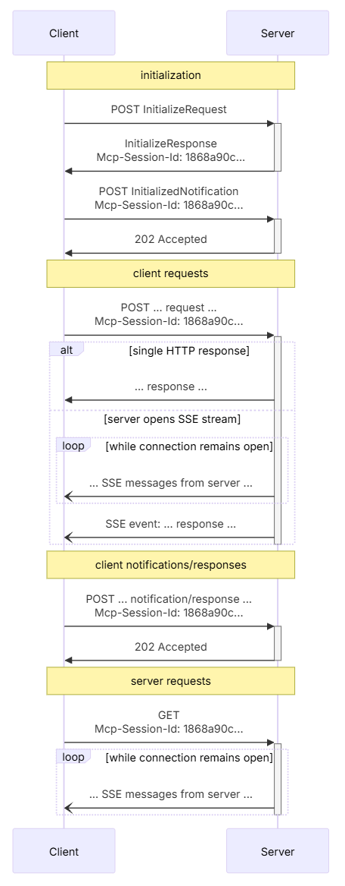

**这里的主要变化包括：**

- Server只需一个统一的HTTP端点（/messages）用于通信
- Client可以完全无状态的方式与Server进行交互，即Restful HTTP Post方式
- 必要时Client也可以在单次请求中获得SSE方式响应，如：一个需要进度通知的长时间运行的任务，可以借助SSE不断推送进度
- Client也可以通过HTTP Get请求来打开一个长连接的SSE流，这种方式与当前的HTTP+SSE模式类似
- 增强的Session管理。Server会在初始化时返回Mcp-Session-Id，后续Client在每次请求中需要携带该MCP-Session-Id。这个Mcp-Session-Id作用是用来关联一次会话的多次交互;Server可以用Session-Id来终止会话，要求Client开启新会话;Client也可以用HTTP Delete请求来终止会话

**Streamable HTTP在旧方案的基础上，提升了传输层的灵活性与健壮性：**

- 允许无状态的Server存在，不依赖长连接。有更好的部署灵活性与扩展能力
- 对Server中间件的兼容性更好，只需要支持HTTP即可，无需做SSE处理
- 允许根据自身需要开启SSE响应或长连接，保留了现有规范SSE模式的优势


### 1.6 何时使用 MCP

以下三个应用场景示例，比较了使用 MCP 和使用传统 API 的区别：

1. **旅行规划助手**
   - 使用 API：需要为日历、电子邮件、航空公司预订 API 编写单独的代码，每个 API 都有自定义的身份验证、上下文传递和错误处理逻辑。
   - 使用 MCP：AI 助手可以顺畅地检查日程安排以确认空档时间，预订机票，并通过电子邮件发送确认信息。全部通过 MCP 服务器实现，无需为每个工具进行自定义集成。
2. **高级 IDE（智能代码编辑器）**
   - 使用 API：需要手动将 IDE 与文件系统、版本控制、包管理器和文档集成。
   - 使用 MCP：IDE 通过单一的 MCP 协议连接到外部系统，实现更丰富的上下文感知和更强大的建议功能。
3. **复杂数据分析**
   - 使用 API：需要手动管理与每个数据库和数据可视化工具的连接。
   - 使用 MCP：智能分析平台通过统一的 MCP 层自主发现并与多个数据库、可视化工具和模拟工具进行交互。

#### 1.6.1 使用 MCP 的好处

- **简化开发**：一次编写，多次集成，无需为每次集成重写自定义代码。
- **灵活性**：切换 AI 模型或工具无需复杂重新配置。
- **实时响应能力**：MCP 连接保持活跃，实现实时上下文更新和交互。
- **安全性和合规性**：内置访问控制和标准化安全实践。
- **可扩展性**：随着 AI 应用系统的迭代，轻松添加新功能 。只需新增连接到另一个 MCP 服务器。

#### 1.6.2 何时传统 API 更合适

如果使用场景需要精确、可预测的交互，并且有严格的限制，那么传统 API 可能更合适。MCP 提供广泛、动态的功能，适用于需要灵活性和上下文感知的场景，但对于高度受控、确定性的应用场景，可能不太适合。

当需要以下情况时，使用传统 API 会更合适：

- 需要细粒度控制和高度特定、受限的功能。
- 希望通过紧密耦合来优化性能。
- 希望在最小化上下文自主性的情况下获得最大可预测性。

#### 1.6.3 使用 MCP 的步骤

1. **定义功能**：明确 MCP 服务器将提供什么功能。
2. **实现 MCP 层**：遵循标准化的 MCP 协议规范。
3. **选择传输方式**：决定使用本地（标准输入输出）还是远程（服务器发送事件 / WebSocket）方式。
4. **创建资源 / 工具**：开发或连接到具体的数据源和服务，并将其暴露给 MCP 服务。
5. **设置客户端**：建立 MCP 服务器和客户端之间的安全稳定连接。


### 1.7 参考文档

1. MCP 官方文档：https://modelcontextprotocol.io/introduction
2. MCP python SDK：https://github.com/modelcontextprotocol/python-sdk
3. 支持 MCP 协议的 server：https://github.com/modelcontextprotocol/servers
4. Norah Sakal Blog：https://norahsakal.com/blog/mcp-vs-api-model-context-protocol-explained/


## 第二章 MCP客户端与服务端交互流程


介绍 MCP 客户端与客户端的交互流程，并以 MCP 的官方 python sdk 代码为例进行代码详解，以帮助更好地理解相关知识。


### 2.1 核心功能对象

- **会话管理**：管理用户与 LLM 的交互对话，维护对话的历史消息；关联 MCP 客户端。
- **MCP 客户端**：保持与 MCP 服务端 1:1 连接的协议客户端。
- **MCP 服务端**：通过标准化的 MCP（模型上下文协议）暴露特定功能的轻量级程序（如：暴露工具，并提供工具调用服务）
- **工具集**：MCP 服务端管理的工具集。

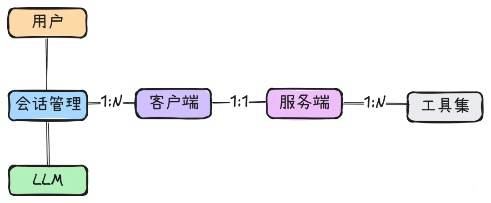


### 2.2 客户端与服务端交互流程

MCP 服务端可以提供资源（Resources）、工具（Tools）等 API，供客户端调用。这里以 MCP 的官方 python sdk 的示例代码 mcp_simple_chatbot （https://github.com/modelcontextprotocol/python-sdk/blob/main/examples/clients/simple-chatbot/mcp_simple_chatbot/main.py）为例，说明 MCP 客户端与 MCP 服务端交互的交互流程，实现 LLM 对外部工具的调用。

1. 用户输入问题
2. 会话管理（ChatSession）将问题发送给 LLMClient
3. LLMClient 调用 LLM API，获取 LLM 的响应
4. 根据 LLM 响应判断是否需要使用工具，若要使用工具，执行以下流程：
   - 请求 Server 执行工具（请求内容包含工具名、参数等信息）
   - Server 调用具体的 Tool，并返回工具执行结果
   - ChatSession 将工具结果发送给 LLM
   - LLM 根据工具执行结果，返回最终响应
5. 会话管理（ChatSession）将最终响应返回给用户

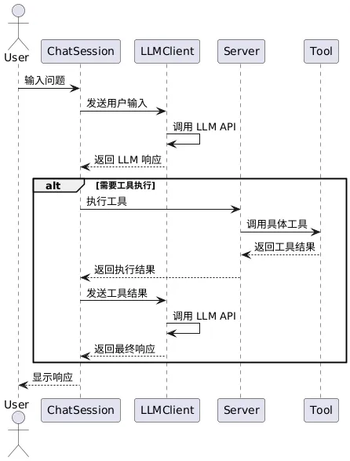


### 2.3 mcp_simple_chatbot 代码详解

官方的 mcp_simple_chatbot 示例（https://github.com/modelcontextprotocol/python-sdk/blob/main/examples/clients/simple-chatbot/mcp_simple_chatbot/main.py），实现了基于 MCP 协议的外部工具调用。以下介绍其核心代码。

#### 2.3.1 Server

Server 类是 MCP 客户端中负责管理与 MCP 服务器连接和工具执行的核心组件。

1. **初始化与配置管理**

- 管理服务器名称和配置信息
- 维护客户端会话状态
- 使用锁机制确保资源清理的线程安全
- 使用 AsyncExitStack 管理异步资源

```python
def __init__(self, name: str, config: dict[str, Any]) -> None:
    self.name: str = name
    self.config: dict[str, Any] = config
    self.stdio_context: Any | None = None
    self.session: ClientSession | None = None
    self._cleanup_lock: asyncio.Lock = asyncio.Lock()
    self.exit_stack: AsyncExitStack = AsyncExitStack()
```

2. **服务器连接初始化**

这里的 MCP 服务端是在本地机器上运行的（运行相关命令 command，启动 MCP 服务端）

- 解析并验证服务器启动命令
- 配置服务器参数（命令、参数、环境变量）
- 建立与服务器的通信通道
- 初始化客户端会话

```python
async def initialize(self) -> None:
    """Initialize the server connection."""
    command = (
        shutil.which("npx")
        if self.config["command"] == "npx"
        else self.config["command"]
    )
    if command isNone:
        raise ValueError("The command must be a valid string and cannot be None.")

    server_params = StdioServerParameters(
        command=command,
        args=self.config["args"],
        env={**os.environ, **self.config["env"]}
        if self.config.get("env")
        elseNone,
    )
    try:
        stdio_transport = await self.exit_stack.enter_async_context(
            stdio_client(server_params)
        )
        read, write = stdio_transport
        session = await self.exit_stack.enter_async_context(
            ClientSession(read, write)
        )
        await session.initialize()
        self.session = session
    except Exception as e:
        logging.error(f"Error initializing server {self.name}: {e}")
        await self.cleanup()
        raise
```

3. **工具管理**

- **MCP 服务端提供相关的 API，暴露给其可提供的工具集信息（将外部资源工具，以接口服务的形式提供，这是 MCP 与 Function Call 的区别之一）**。调用服务端 API，获取全部工具信息。
- 将工具信息转换为标准格式并返回

```python
async def list_tools(self) -> list[Any]:
    """List available tools from the server.

    Returns:
        A list of available tools.

    Raises:
        RuntimeError: If the server is not initialized.
    """
    ifnot self.session:
        raise RuntimeError(f"Server {self.name} not initialized")

    tools_response = await self.session.list_tools()
    tools = []

    for item in tools_response:
        if isinstance(item, tuple) and item[0] == "tools":
            for tool in item[1]:
                tools.append(Tool(tool.name, tool.description, tool.inputSchema))

    return tools
```

4. **工具执行**

- 执行指定的工具，并返回结果
- 提供重试机制处理临时故障，支持自定义重试次数和延迟

```python
async def execute_tool(
        self,
        tool_name: str,
        arguments: dict[str, Any],
        retries: int = 2,
        delay: float = 1.0,
) -> Any:
    """Execute a tool with retry mechanism.

    Args:
        tool_name: Name of the tool to execute.
        arguments: Tool arguments.
        retries: Number of retry attempts.
        delay: Delay between retries in seconds.

    Returns:
        Tool execution result.

    Raises:
        RuntimeError: If server is not initialized.
        Exception: If tool execution fails after all retries.
    """
    ifnot self.session:
        raise RuntimeError(f"Server {self.name} not initialized")

    attempt = 0
    while attempt < retries:
        try:
            logging.info(f"Executing {tool_name}...")
            result = await self.session.call_tool(tool_name, arguments)

            return result

        except Exception as e:
            attempt += 1
            logging.warning(
                f"Error executing tool: {e}. Attempt {attempt} of {retries}."
            )
            if attempt < retries:
                logging.info(f"Retrying in {delay} seconds...")
                await asyncio.sleep(delay)
            else:
                logging.error("Max retries reached. Failing.")
                raise
```

#### 2.3.2 Tool 类

Tool 类提供的工具的定义和格式化功能

1. 定义

- 工具名称：唯一标识符
- 工具描述：说明工具的功能和用途
- 输入模式：定义工具的参数和类型

```Python
def __init__(
        self, name: str, description: str, input_schema: dict[str, Any]
    ) -> None:
    self.name: str = name
    self.description: str = description
    self.input_schema: dict[str, Any] = input_schema
```

2. 格式化功能

为 LLM 格式化工具信息

- 生成参数描述，标记必需参数
- 提供清晰的工具文档

```python
def format_for_llm(self) -> str:
    """Format tool information for LLM.

    Returns:
        A formatted string describing the tool.
    """
    args_desc = []
    if"properties"in self.input_schema:
        for param_name, param_info in self.input_schema["properties"].items():
            arg_desc = (
                f"- {param_name}: {param_info.get('description', 'No description')}"
            )
            if param_name in self.input_schema.get("required", []):
                arg_desc += " (required)"
            args_desc.append(arg_desc)

    return f"""
Tool: {self.name}
Description: {self.description}
Arguments:
{chr(10).join(args_desc)}
"""
```

#### 2.3.3 LLMClient

LLMClient 负责管理与 LLM 的连接，向 LLM 发送请求，获取 LLM 返回的响应

```python
try:
    with httpx.Client() as client:
        response = client.post(url, headers=headers, json=payload)
        response.raise_for_status()
        data = response.json()
        return data["choices"][0]["message"]["content"]
    
except httpx.RequestError as e:
    error_message = f"Error getting LLM response: {str(e)}"
    logging.error(error_message)

    if isinstance(e, httpx.HTTPStatusError):
        status_code = e.response.status_code
        logging.error(f"Status code: {status_code}")
        logging.error(f"Response details: {e.response.text}")
        
    return (
        f"I encountered an error: {error_message}. "
        "Please try again or rephrase your request."
    )
```

#### 2.3.4 ChatSession 类

ChatSession（会话管理）负责协调用户、LLM 和客户端之间交互

1. **LLM 响应处理**
   - 解析 LLM 响应，判断 LLM 是否要求调用工具
   - 若 LLM 响应包含调用工具信息，执行相应的工具，并返回工具执行结果

```python
async def process_llm_response(self, llm_response: str) -> str:
    """Process the LLM response and execute tools if needed.

    Args:
        llm_response: The response from the LLM.

    Returns:
        The result of tool execution or the original response.
    """
    import json

    try:
        tool_call = json.loads(llm_response)
        if"tool"in tool_call and"arguments"in tool_call:
            logging.info(f"Executing tool: {tool_call['tool']}")
            logging.info(f"With arguments: {tool_call['arguments']}")

            for server in self.servers:
                tools = await server.list_tools()
                if any(tool.name == tool_call["tool"] for tool in tools):
                    try:
                        result = await server.execute_tool(
                            tool_call["tool"], tool_call["arguments"]
                        )

                        if isinstance(result, dict) and"progress"in result:
                            progress = result["progress"]
                            total = result["total"]
                            percentage = (progress / total) * 100
                            logging.info(
                                f"Progress: {progress}/{total} "
                                f"({percentage:.1f}%)"
                            )

                        returnf"Tool execution result: {result}"
                    except Exception as e:
                        error_msg = f"Error executing tool: {str(e)}"
                        logging.error(error_msg)
                        return error_msg

            returnf"No server found with tool: {tool_call['tool']}"
        return llm_response
    except json.JSONDecodeError:
        return llm_response
```

2. **对话管理**

   - 初始化服务器环境

   - 收集 MCP 服务端提供的全部工具信息

   - 构建系统提示（**这里的系统 prompt 比较关键，要求 LLM 自行判断是否要执行工具。LLM 若判断要执行工具，需要按照规定的 Json 格式，返回工具调用请求信息**）

   - 主循环处理：
     1. 处理用户输入
     2. 管理对话上下文，将历史对话信息保存在 messages
     3. 协调工具执行，并将工具执行结果保存到对话上下文
     4. 生成最终响应

```python
async def start(self) -> None:
    """Main chat session handler."""
    try:
        for server in self.servers:
            try:
                await server.initialize()
            except Exception as e:
                logging.error(f"Failed to initialize server: {e}")
                await self.cleanup_servers()
                return

        all_tools = []
        for server in self.servers:
            tools = await server.list_tools()
            all_tools.extend(tools)

        tools_description = "\n".join([tool.format_for_llm() for tool in all_tools])

        system_message = (
            "You are a helpful assistant with access to these tools:\n\n"
            f"{tools_description}\n"
            "Choose the appropriate tool based on the user's question. "
            "If no tool is needed, reply directly.\n\n"
            "IMPORTANT: When you need to use a tool, you must ONLY respond with "
            "the exact JSON object format below, nothing else:\n"
            "{\n"
            '    "tool": "tool-name",\n'
            '    "arguments": {\n'
            '        "argument-name": "value"\n'
            "    }\n"
            "}\n\n"
            "After receiving a tool's response:\n"
            "1. Transform the raw data into a natural, conversational response\n"
            "2. Keep responses concise but informative\n"
            "3. Focus on the most relevant information\n"
            "4. Use appropriate context from the user's question\n"
            "5. Avoid simply repeating the raw data\n\n"
            "Please use only the tools that are explicitly defined above."
        )

        messages = [{"role": "system", "content": system_message}]

        whileTrue:
            try:
                user_input = input("You: ").strip().lower()
                if user_input in ["quit", "exit"]:
                    logging.info("\nExiting...")
                    break

                messages.append({"role": "user", "content": user_input})

                llm_response = self.llm_client.get_response(messages)
                logging.info("\nAssistant: %s", llm_response)

                result = await self.process_llm_response(llm_response)

                if result != llm_response:
                    messages.append({"role": "assistant", "content": llm_response})
                    messages.append({"role": "system", "content": result})

                    final_response = self.llm_client.get_response(messages)
                    logging.info("\nFinal response: %s", final_response)
                    messages.append(
                        {"role": "assistant", "content": final_response}
                    )
                else:
                    messages.append({"role": "assistant", "content": llm_response})

            except KeyboardInterrupt:
                logging.info("\nExiting...")
                break

    finally:
        await self.cleanup_servers()
```

#### 2.3.5 main 函数

1. 设置必要的环境
2. 初始化所有组件
3. 建立必要的连接
4. 启动交互式会话

```python
async def main() -> None:
    """Initialize and run the chat session."""
    config = Configuration()
    server_config = config.load_config("servers_config.json")
    servers = [
        Server(name, srv_config)
        for name, srv_config in server_config["mcpServers"].items()
    ]
    llm_client = LLMClient(config.llm_api_key)
    chat_session = ChatSession(servers, llm_client)
    await chat_session.start()
```


## 第三章 MCP编程实战 - 服务端的开发与功能验证


本章从开发实践的角度出发，介绍 MCP 服务端的编码开发及其功能验证步骤，主要内容有：

1. **介绍 MCP 服务端提供的服务类型（Resource、Prompt、Tool）及其适用场景。**
2. **一个服务端的编码开发示例：通过 Resource 访问数据库数据；通过 Prompt 生成代码调试提示模板；通过 Tool 实现数学运算功能。**
3. **使用 MCP Inspector，高效地对开发的 MCP 服务端功能进行测试验证。**


### 3.1 服务端提供的服务类型

MCP 服务端（servers）可以为客户端（clients）提供 Resources、tools 和 prompts 三类服务。

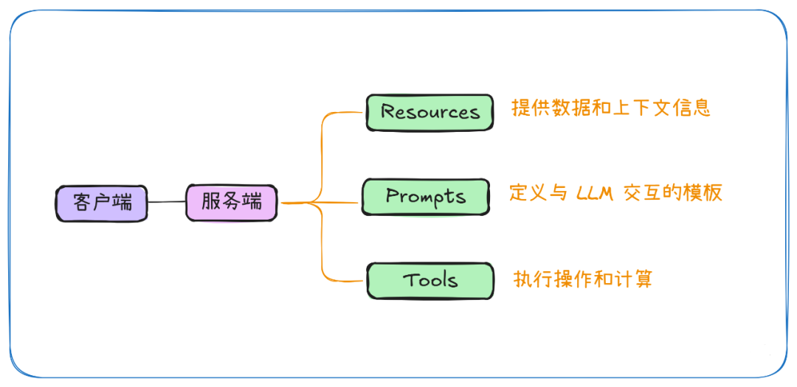

#### 3.1.1 Resources

**Resources 是 MCP 中的一个核心原语，它允许 servers 暴露可以被 clients 读取并用作与 LLM 交互的上下文数据和内容。**

**用途**：提供数据和上下文信息

**特点**：

- 只读操作
- 类似 REST API 的 GET 请求
- 使用 URI 风格的路径
- 适合缓存

**典型场景**：

- 读取文件内容
- 获取配置信息
- 查询数据库数据
- 获取系统状态 

每个 resource 都由一个唯一的 URI 标识，并且可以包含文本或二进制数据。

#### 3.1.2 Prompts

**Prompts 允许 servers 定义可复用的提示模板和工作流，clients 可以轻松地将它们呈现给用户和 LLMs。Prompts 提供了一种强大的方式来标准化和共享常见的 LLM 交互。**

**用途**：定义与 LLM 交互的模板**特点**：

- 提供结构化的提示模板
- 可以包含参数
- 指导 LLM 的输出
- 可重用的交互模式

**典型场景**：

- 生成文本模板
- 定义对话流程
- 标准化 LLM 输出
- 创建特定任务的指令

#### 3.1.3 Tools

**Tools 使 servers 能够向 clients 暴露可执行功能。通过 tools，LLMs 可以与外部系统交互、执行计算并在现实世界中采取行动。**

Tools 的关键特性有：

- Discovery (发现)：Clients 可以通过 tools/list endpoint 列出可用的 tools
- Invocation (调用)：Tools 使用 tools/call endpoint 调用，其中 servers 执行请求的操作并返回结果
- Flexibility (灵活性)：Tools 的范围可以从简单的计算到复杂的 API 交互

**用途**：执行操作和计算

**特点**：

- 可以影响或修改外部系统的状态
- 类似 REST API 的 POST/PUT/DELETE
- 执行具体的功能

**典型场景**：

- 数学计算
- 数据处理
- API 调用
- 文件操作

与 resources 一样，tools 通过唯一的名称进行标识，并且可以包含描述以指导其使用。但是，与 resources 不同的是，tools 代表可以修改状态或与外部系统交互的动态操作。

#### 3.1.4 三类服务功能比较

| 特性     | Resource | Tool     | Prompt   |
| :------- | :------- | :------- | :------- |
| 主要功能 | 提供数据 | 执行操作 | 定义模板 |
| 操作类型 | 只读     | 读写     | 模板定义 |
| 状态修改 | 否       | 是       | 否       |
| 缓存支持 | 是       | 否       | 是       |
| 典型用途 | 数据获取 | 功能执行 | 交互指导 |


### 3.2 一个服务端的编程实现示例

#### 3.2.1 项目创建

**1. 安装 uv**

本文使用 uv 作为包管理工具（也可以使用  pip、poetry、conda 其他包管理工具）。uv 是 Astral 公司推出的一款基于 Rust 编写的 Python 包管理工具，提供了快速、可靠且易用的包管理体验，在性能、兼容性和功能上都有出色表现。

安装 uv 工具命令（以 windows 为例）:

```bash
# On Windows.
powershell -ExecutionPolicy ByPass -c "irm https://astral.sh/uv/install.ps1 | iex"

# With pip.
pip install uv
```

uv 的相关命令介绍

```bash
An extremely fast Python package manager.

Usage: uv [OPTIONS] <COMMAND>

Commands:
  run                        Run a command or script
  init                       Create a new project
  add                        Add dependencies to the project
  remove                     Remove dependencies from the project
  sync                       Update the project's environment
  lock                       Update the project's lockfile
  export                     Export the project's lockfile to an alternate format
  tree                       Display the project's dependency tree
  tool                       Run and install commands provided by Python packages
  python                     Manage Python versions and installations
  pip                        Manage Python packages with a pip-compatible interface
  venv                       Create a virtual environment
  build                      Build Python packages into source distributions and wheels
  publish                    Upload distributions to an index
  cache                      Manage uv's cache
  self                       Manage the uv executable
  version                    Display uv's version
  generate-shell-completion  Generate shell completion
  help                       Display documentation for a command
```

**2. 创建 python 项目**

使用 uv 命令，创建项目

```bash
# 创建 python 项目，项目名称为 mcp_learning
uv init mcp_learning
cd mcp_learning

# 激活虚拟环境
uv venv
.venv\Scripts\activate
```

**3. 安装 python 依赖包**

```bash
# 安装相关依赖包
uv add mcp[cli] httpx

# 连接 pg 数据库的 python 包
uv add psycopg2
```

**4. 安装 node.js**

本示例会用到 MCP Inspector 来测试验证服务端的功能（MCP Inspector 是一个用于测试和调试 MCP 服务端的交互式开发者工具）。MCP Inspector 运行，需要依赖 npx，因此需要安装 node.js。

在 https://nodejs.org/zh-cn/download，选择 v22.17.0（LTS） 版本进行下载并安装：

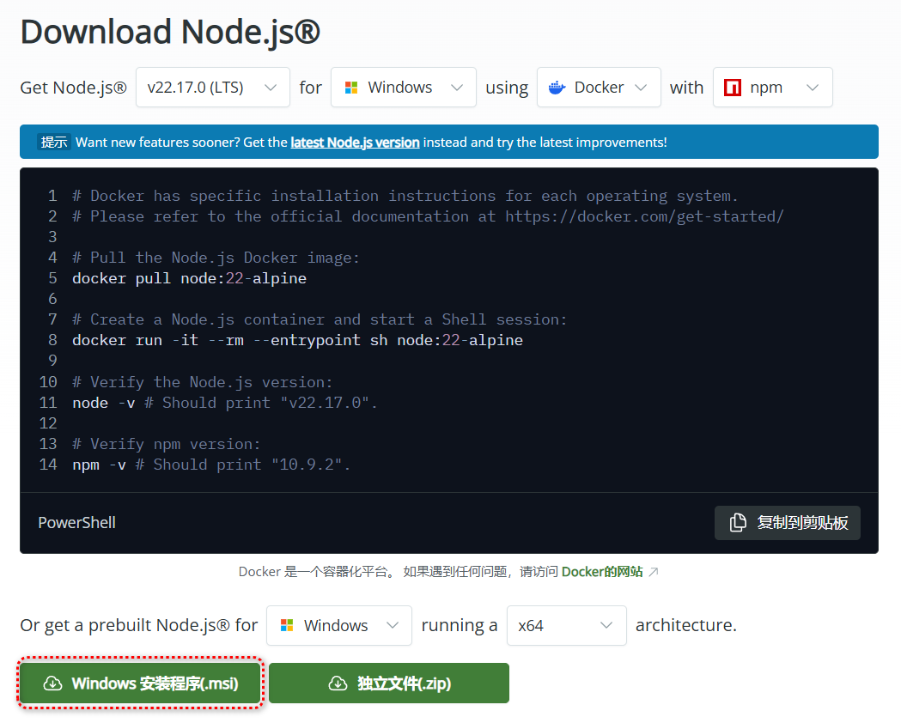

#### 3.2.2 创建服务端实例

- FastMCP 为 MCP 服务端的主要实现类。创建服务端名称为 "MCP Test Server" 的实例
- 启用了调试模式，产生更详细的日志输出，方便调试。
- 服务器配置为监听 0.0.0.0（所有网络接口），接受来自本地和远程的连接
- 端口设置为 8002，这是客户端连接服务器的端口

注意：host="0.0.0.0" 设置使服务器可以接受来自任何 IP 地址的连接，这在开发环境中很方便，但在生产环境中可能需要更严格的访问控制。

```python
# 导入必要的模块
from mcp.server.fastmcp import FastMCP  # 导入 MCP 服务器的主类
import psycopg2  # PostgreSQL 数据库连接库
import json  # JSON 处理库
from psycopg2.extras import RealDictCursor  # 使查询结果以字典形式返回的游标
from mcp.server.fastmcp.prompts import base  # MCP 提示模板的基础类


# 创建 MCP 服务器
mcp = FastMCP("MCP Test Server",  # 服务器名称
              debug=True,  # 启用调试模式，会输出详细日志
              host="0.0.0.0",  # 监听所有网络接口，允许远程连接
              port=8002)  # 服务器监听的端口号
```

#### 3.2.3 Resources 实现

**mcp 服务端可以为 mcp 客户端定义访问数据库数据的资源端点，允许客户端查询数据库的元数据、数据表数据**。下面以访问 pg 数据库数据为例。

**1. 数据库连接**

定义连接 PostgreSQL 数据库的配置，定义创建数据库连接的函数。

```python
# 数据库连接配置
DB_CONFIG = {
    "dbname": "mcp_test",
    "user": "kevin",
    "password": "123456",
    "host": "localhost",
    "port": "5432"
}

def get_db_connection():
    """创建数据库连接"""
    return psycopg2.connect(**DB_CONFIG)
```

**2. 资源定义测试示例**

简单的测试资源，用于验证服务器是否正常工作。当客户端请求 test://hello 资源时，将返回 "Hello, World!" 字符串。

```python
@mcp.resource("test://hello")
def hello() -> str:
    """简单的测试资源"""
    return "Hello, World!"
```

**3. 表名列表查询**

查询数据库中 public 模式下的全部表名，返回一个表名列表的 JSON 字符串。

```python
# 定义资源：获取所有表名
@mcp.resource("db://tables")
def list_tables() -> str:
    """获取所有表名列表"""
    with get_db_connection() as conn:
        with conn.cursor() as cur:
            cur.execute("""
                SELECT table_name
                FROM information_schema.tables
                WHERE table_schema = 'public'
            """)
            tables = [row[0] for row in cur.fetchall()]
            return json.dumps(tables)
```

**4. 表数据查询**

定义数据表查询的资源，允许查询指定表的数据，支持参数：

- table_name: 要查询的表名
- limit: 限制返回的最大行数，默认值为 100

使用了 RealDictCursor 使结果以字典形式返回，使用了参数化查询来防止 SQL 注入攻击，并设置 ensure_ascii=False 以保留中文字符。

```python
# 定义资源：获取表数据
@mcp.resource("db://tables/{table_name}/data/{limit}")
def get_table_data(table_name: str, limit: int = 100) -> str:
    """获取指定表的数据

    参数:
    table_name: 表名
    """
    try:
        with get_db_connection() as conn:
            with conn.cursor(cursor_factory=RealDictCursor) as cur:
                # 使用参数化查询防止 SQL 注入
                cur.execute(f"SELECT * FROM %s LIMIT %s",
                            (psycopg2.extensions.AsIs(table_name), limit))
                rows = cur.fetchall()
                # return json.dumps(list(rows), default=str)
                return json.dumps(list(rows), default=str, ensure_ascii=False)
    except Exception as e:
        return json.dumps({
            "status": "error",
            "message": str(e)
        })
```

**5. 表结构查询**

定义表结构查询的资源，允许查询指定表的结构信息，包括列名、数据类型、最大长度和列注释。（不同类型的数据库，查询表元数据的 sql 会有所不同）。

```python
# 定义资源：获取表结构
@mcp.resource("db://tables/{table_name}/schema")
def get_table_schema(table_name: str) -> str:
    """获取表结构信息

    参数:
    table_name: 表名
    """
    with get_db_connection() as conn:
        with conn.cursor() as cur:
            cur.execute("""
                select c.column_name, 
                       c.data_type, 
                       c.character_maximum_length,
                       pgd.description as column_comment
                from information_schema.columns c
                left join pg_catalog.pg_statio_all_tables st 
                on c.table_schema = st.schemaname and c.table_name = st.relname
                left join pg_catalog.pg_description pgd 
                on pgd.objoid = st.relid 
                   and pgd.objsubid = c.ordinal_position
                where c.table_name = %s
                order by c.ordinal_position
            """, (table_name,))
            columns = [{"name": row[0], "type": row[1], "max_length": row[2], "comment": row[3]}
                       for row in cur.fetchall()]
            return json.dumps(columns, ensure_ascii=False)
```

#### 3.2.4 Prompts 实现

定义了 MCP prompt（提示模板），用于指导 LLM 如何回答特定类型的查询。

**1. 中国省份介绍**

- 使用 @mcp.prompt() 装饰器注册为 MCP 服务器的提示模板
- 接受一个参数 province，表示要介绍的中国省份名称
- 返回一个字符串提示模板，引导 LLM 按照特定结构介绍指定省份
- 提示模板要求 LLM 从四个方面介绍省份：历史沿革、人文地理和风俗习惯、经济发展状况、旅游建议

```python
# 中国省份介绍
@mcp.prompt()
def introduce_china_province(province: str) -> str:
    """介绍中国省份

    参数:
    province: 省份名称
    """
    return f"""
    请介绍这个省份：{province}

    要求介绍以下内容：
    1. 历史沿革
    2. 人文地理、风俗习惯
    3. 经济发展状况
    4. 旅游建议
    """
```

**2. 代码调试提示模板**

提示模板的功能：

- 使用 @mcp.prompt() 装饰器注册
- 接受两个参数：code（需要调试的代码）和 error_message（错误信息）
- **与第一个模板不同，这个模板返回的是 list[base.Message] 类型，表示一个多轮对话的消息列表**

对话包含五条消息：

1. 系统消息：定义助手的角色和任务
2. 用户消息：请求帮助修复代码
3. 用户消息：包含代码内容（使用代码块格式）
4. 用户消息：包含错误信息
5. 助手消息：初始回应，表明将分析问题

使用场景：**当用户遇到代码错误需要帮助调试时，通过预设对话历史，引导 LLM 进入特定的思考模式，提供结构化的上下文，使 LLM 能够更有效地分析和解决代码问题。**

```python
# 调试代码提示
@mcp.prompt()
def debug_code(code: str, error_message: str) -> list[base.Message]:
    """调试代码的对话式提示模板

    参数:
    code: 需要调试的代码
    error_message: 错误信息
    """
    return [
        base.SystemMessage("你是一位专业的代码调试助手。请仔细分析用户提供的代码和错误信息，找出问题所在并提供修复方案。"),
        base.UserMessage("我的代码有问题，请帮我修复："),
        base.UserMessage(f"```\n{code}\n```"),
        base.UserMessage(f"错误信息：\n{error_message}"),
        base.AssistantMessage("我会帮你分析这段代码和错误信息。首先让我理解问题所在..."),
    ]
```

#### 3.2.5 Tools 实现

定义了四个基本的数学运算工具，通过 @mcp.tool() 装饰器，将这些函数注册为 MCP 服务端的工具（可以被客户端直接调用）

```python
@mcp.tool()
def add(a: float, b: float) -> float:
    """加法运算

    参数:
    a: 第一个数字
    b: 第二个数字

    返回:
    两数之和
    """
    return a + b


@mcp.tool()
def subtract(a: float, b: float) -> float:
    """减法运算

    参数:
    a: 第一个数字
    b: 第二个数字

    返回:
    两数之差 (a - b)
    """
    return a - b


@mcp.tool()
def multiply(a: float, b: float) -> float:
    """乘法运算

    参数:
    a: 第一个数字
    b: 第二个数字

    返回:
    两数之积
    """
    return a * b


@mcp.tool()
def divide(a: float, b: float) -> float:
    """除法运算

    参数:
    a: 被除数
    b: 除数

    返回:
    两数之商 (a / b)

    异常:
    ValueError: 当除数为零时
    """
    if b == 0:
        raise ValueError("除数不能为零")
    return a / b
```

#### 3.2.6 main 函数

mcp 服务端提供 stdio 和 sse 两种传输协议运行方式。默认是使用 stdio 协议（适用于本地调试）。sse 协议适用于生产环境。

```python
if __name__ == "__main__":
    mcp.run('sse')
```


### 3.3 使用 MCP Inspector 验证服务端功能

**MCP Inspector 是专为 MCP 服务端设计的交互式调试工具，提供了一个直观的界面，使得开发者能够快速地验证服务端的响应和状态。**使用 MCP Inspector 来测试验证上述开发的服务端功能。

#### 3.3.1 运行 MCP Inspector

在终端运行 mcp --help，可以查看 mcp 命令的用法（由下面的返回结果可知，可以通过 mcp dev 命令运行 mcp inspector）：

```bash
>mcp --help
```

mcp dev 命令语法：

```bash
mcp dev --help
```

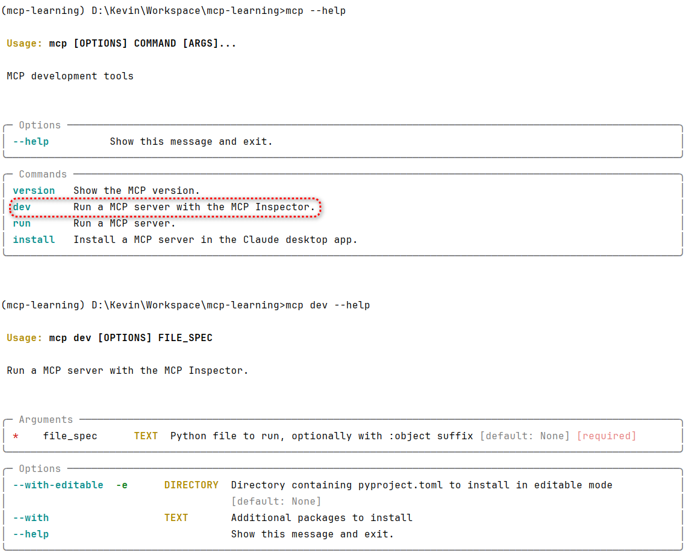

运行命令：mcp dev db_server_sse.py（ mcp dev 命令默认使用 stdio 通信方式来启动 mcp 服务端），对上面开发的 mcp 服务端功能进行测试。点击输出的链接，即可打开浏览器，进入 mcp inspector 用户界面：

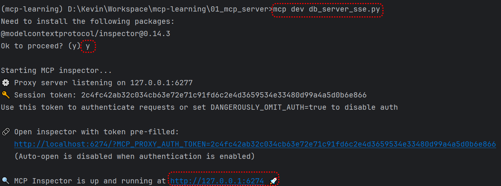

打开 mcp inspector 的页面，点击左侧的 connect 按钮，连接到 mcp 服务端：

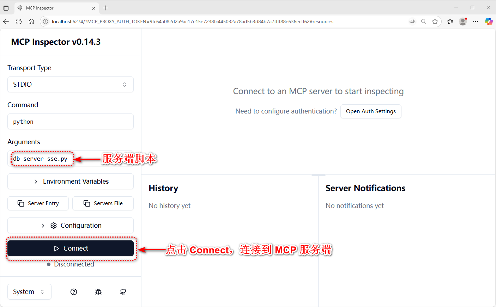

连接到 mcp 服务端后，左侧的页面顶部显示 Resources、Prompts、Tools 三个按钮，可以分别对服务端暴露的 Resources、Prompts、Tools 功能进行测试验证。

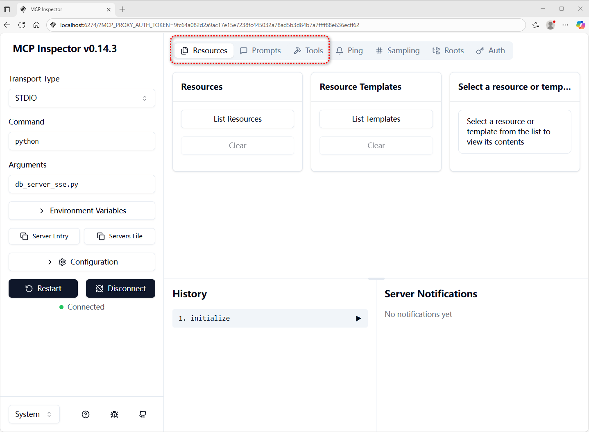

#### 3.3.2 Resources 功能验证

点击 Resources，然后点击下方的 List Resources、List Templates，可以查看资源 list。

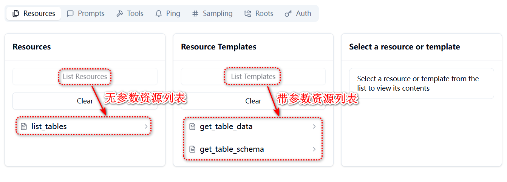

查看数据库的数据表清单，点击资源 URI `list_table` 后，右侧可以查看到 mcp 服务端返回的内容，目前数据库有两张数据表，分别是 `chinese_provinces`、`chinese_movie_ratings` 两张表：

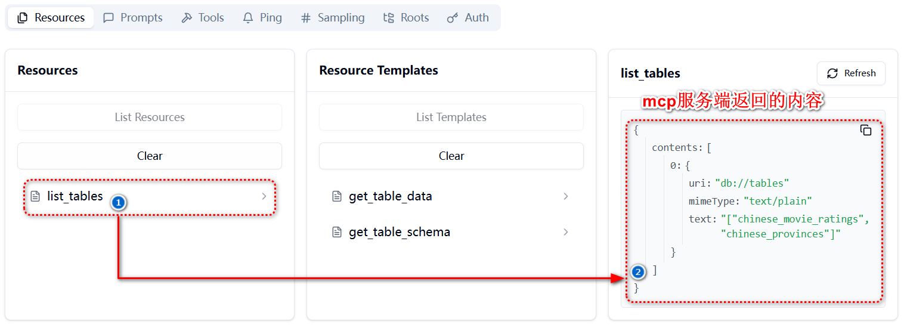

查看具体某张数据表的数据内容。点击 get_table_data 资源，输入表名参数和 limit 参数，点击 Read Resource，可以查看 mcp 服务端返回的数据表数据：

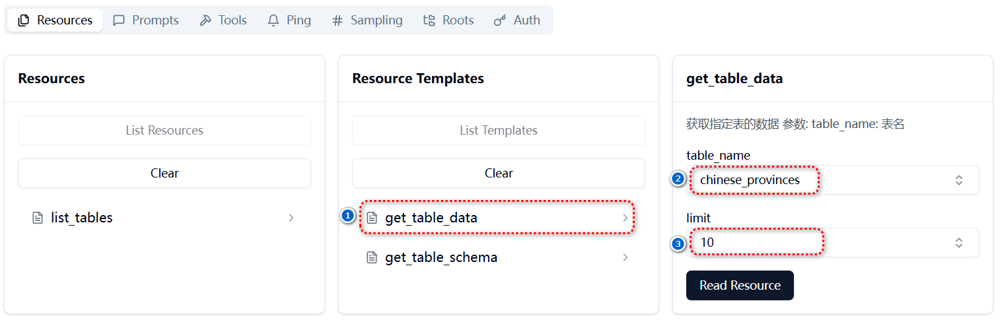

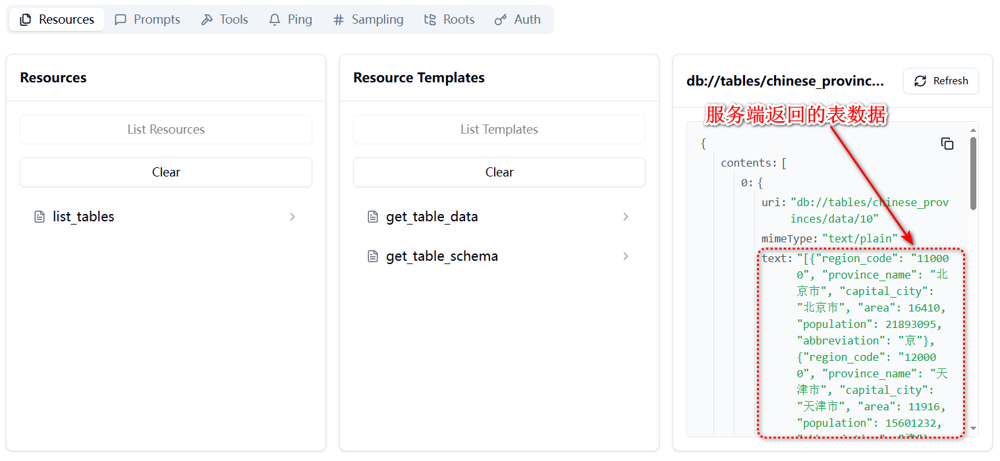

#### 3.3.3 Prompts 功能验证

点击 Prompts 下的 List Prompts，列出全部 Prompts：

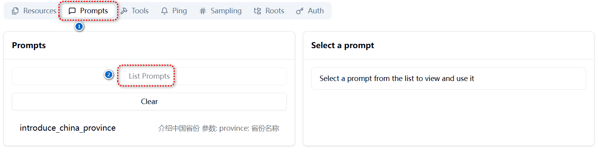

选择其中一个 Prompt，输入参数 （如，广东省），点击 Get Prompt，即可按照预先设定的 prompt 模板，生成 prompt：

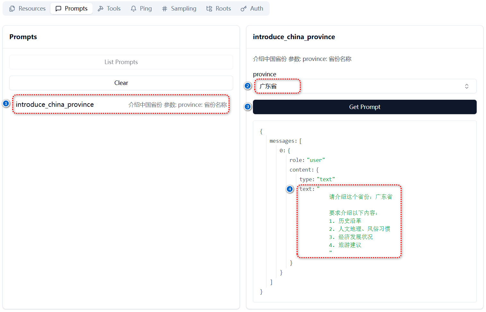

#### 3.3.4 Tools 功能验证

点击 Tools 下的 List Tools，列出全部工具，选择其中一个，输入参数，点击 Run Tools，即可调用工具，获取返回的运行结果：

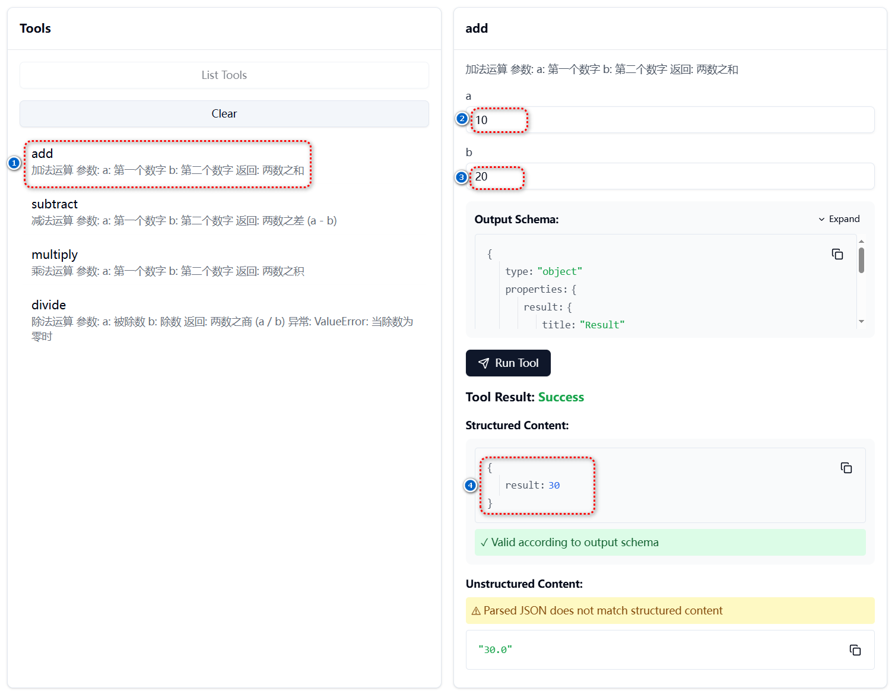

通过 mcp inspector，可以快捷高效地测试验证我们开发的 mcp 服务端功能。


## 第四章 MCP编程实战 - 基于 SSE 传输方式的客户端编码实现


本章介绍 MCP 客户端的编程实现。本文主要内容如下：

1. **MCP 的 Client-Server 生命周期**
2. **MCP 客户端的编码实现，包括与服务端连接的握手、与服务端的操作交互（调用工具、获取提示模板、读取资源）**
3. **客户端的功能测试验证**


### 4.1 Client-Server 生命周期

MCP 定义了一套严格的客户端-服务器连接生命周期，确保规范化的能力协商和状态管理：

1. 初始化阶段：完成能力协商与协议版本协商一致
2. 操作阶段：进行正常的协议通信
3. 关闭阶段：实现连接的优雅终止（Graceful termination）

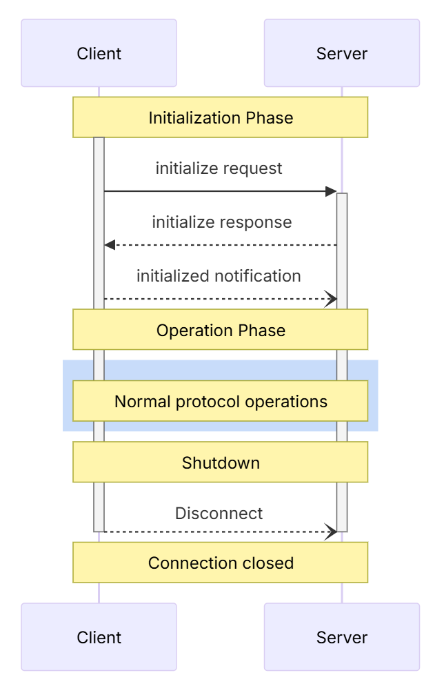

#### 4.1.1 初始化（Initialization）

**初始化阶段必须是客户端与服务器的首次交互。**初始化阶段步骤如下（类似于传统API的握手协议）：

1. 客户端向服务端发送 initialize request（包含协议版本、能力集、客户端信息）
2. 服务端返回版本及能力信息（initialize response）
3. 客户端发送 initialize notification，通知确认。

阅读 mcp python sdk 的 ClientSession 类，我们可以看到，调用其 initialize 方法，即可实现上述初始化的三个步骤：

```python
async def initialize(self) -> types.InitializeResult:
    sampling = types.SamplingCapability()
    roots = types.RootsCapability(
        # TODO: Should this be based on whether we
        # _will_ send notifications, or only whether
        # they're supported?
        listChanged=True,
    )

    result = await self.send_request(
        types.ClientRequest(
            types.InitializeRequest(
                method="initialize",
                params=types.InitializeRequestParams(
                    protocolVersion=types.LATEST_PROTOCOL_VERSION,
                    capabilities=types.ClientCapabilities(
                        sampling=sampling,
                        experimental=None,
                        roots=roots,
                    ),
                    clientInfo=types.Implementation(name="mcp", version="0.1.0"),
                ),
            )
        ),
        types.InitializeResult,
    )

    if result.protocolVersion notin SUPPORTED_PROTOCOL_VERSIONS:
        raise RuntimeError(
            "Unsupported protocol version from the server: "
            f"{result.protocolVersion}"
        )

        await self.send_notification(
            types.ClientNotification(
                types.InitializedNotification(method="notifications/initialized")
            )
        )

    return result
```

#### 4.1.2 操作阶段（Normal protocol operations）

在操作阶段，客户端与服务器依据已协商的能力交换消息。双方应遵循以下原则：

1. 严格遵守协商一致的协议版本
2. 仅使用已成功协商的能力

#### 4.1.3 关闭阶段（Shutdown）

在关闭阶段，一方（通常为客户端）将干净地终止协议连接。此阶段无需定义特定的关闭消息，而是应通过底层传输机制（如 TCP 的连接关闭流程）通知连接终止。


### 4.2 客户端编程实现

MCP 的官方 python sdk，有基于 stdio 传输方式的客户端代码实现示例（https://github.com/modelcontextprotocol/python-sdk/tree/main/examples/clients/simple-chatbot/mcp_simple_chatbot）。**但 stdio 传输方式，主要是针对本地的调试，以快速地验证核心逻辑。若要应用于生产环境，sse 传输方式更合适。sse 支持跨网络、跨机器环境进行通信，客户端与服务端可实现真正的解耦。**以下是基于 sse 传输方式的客户端编码实现。

#### 4.2.1 定义 MCPClient 类

**1. __init__**

初始化必要的属性，包括会话上下文、流上下文和退出栈。

**2. connect_to_sse_server 方法实现 Initialization**

connect_to_sse_server方法通过SSE（Server-Sent Events）传输方式连接到MCP服务器：

- 使用sse_client创建与指定URL的SSE连接 -使用异步上下文管理器__aenter__()获取通信流
- 使用这些流创建ClientSession对象
- 初始化会话，建立与服务端的协商

**3. cleanup**

在不再需要连接时优雅地关闭所有资源：

- 关闭会话上下文，以正确断开与服务器的通信
- 关闭流上下文，释放网络资源
- 使用__aexit__方法确保异步上下文管理器正确退出

```python
import asyncio
from typing import Optional
from contextlib import AsyncExitStack
from mcp import ClientSession
from mcp.client.sse import sse_client
from typing import Any
import logging
import mcp.types as types
from pydantic import AnyUrl

logging.basicConfig(
    level=logging.INFO, format="%(asctime)s - %(levelname)s - %(message)s"
)

class MCPClient:
    def __init__(self):
        self._session_context = None
        self._streams_context = None
        self.session: Optional[ClientSession] = None
        self.exit_stack = AsyncExitStack()

    asyncdef connect_to_sse_server(self, server_url: str):
        """通过 sse 传输方式连接到 MCP 服务端"""
        self._streams_context = sse_client(url=server_url)
        streams = await self._streams_context.__aenter__()

        self._session_context = ClientSession(*streams)
        self.session: ClientSession = await self._session_context.__aenter__()

        # 初始化
        await self.session.initialize()

    asyncdef cleanup(self):
        """关闭会话和连接流"""
        if self._session_context:
            await self._session_context.__aexit__(None, None, None)
        if self._streams_context:
            await self._streams_context.__aexit__(None, None, None)
```

#### 4.2.2 定义操作方法

给 MCPClient 类定义与服务端交互的方法：

1. 列出全部工具 tools、调用工具。
2. 列出全部提示模板 prompts、读取模板。
3. 列出全部资源 resources、获取资源。

上述的方法实现，是基于 ClientSession 类的方法实现的，并增加异常处理逻辑：

```python
    async def list_tools(self):
        """列出全部工具"""
        try:
            response = await self.session.list_tools()
            tools = response.tools
        except Exception as e:
            error_msg = f"Error executing tool: {str(e)}"
            logging.error(error_msg)
            return error_msg
        return tools

    asyncdef execute_tool(
            self,
            tool_name: str,
            arguments: dict[str, Any]
    ) -> Any:
        """调用工具"""
        try:
            result = await self.session.call_tool(tool_name, arguments)
        except Exception as e:
            error_msg = f"Error executing tool: {str(e)}"
            logging.error(error_msg)
            return error_msg
        return result

    asyncdef list_prompts(self):
        """列出全部提示模板"""
        try:
            prompt_list = await self.session.list_prompts()
        except Exception as e:
            error_msg = f"Error executing tool: {str(e)}"
            logging.error(error_msg)
            return error_msg
        return prompt_list

    asyncdef get_prompt(self, name: str, arguments: dict[str, str] | None = None):
        """读取提示模板内容"""
        try:
            prompt = await self.session.get_prompt(name=name, arguments=arguments)
        except Exception as e:
            error_msg = f"Error executing tool: {str(e)}"
            logging.error(error_msg)
            return error_msg
        return prompt

    asyncdef list_resources(self) -> types.ListResourcesResult:
        """列出全部资源"""
        try:
            list_resources = await self.session.list_resources()
        except Exception as e:
            error_msg = f"Error list resources: {str(e)}"
            logging.error(error_msg)
            return error_msg
        return list_resources

    asyncdef list_resource_templates(self) -> types.ListResourceTemplatesResult:
        """列出全部带参数的资源"""
        try:
            list_resource_templates = await self.session.list_resource_templates()
        except Exception as e:
            error_msg = f"Error list resource templates: {str(e)}"
            logging.error(error_msg)
            return error_msg
        return list_resource_templates

    asyncdef read_resource(self, uri: AnyUrl) -> types.ReadResourceResult:
        """读取资源"""
        try:
            resource_datas = await self.session.read_resource(uri=uri)
        except Exception as e:
            error_msg = f"Error list resource templates: {str(e)}"
            logging.error(error_msg)
            return error_msg
        return resource_datas
```

#### 4.2.3 定义 main 函数

定义 main 函数，验证客户端功能（与服务端连接、调用工具、获取提示模板内容、读取资源）：

```python
async def main():
    if len(sys.argv) < 2:
        print("Usage: python sse_client.py <URL of SSE MCP server (i.e. http://localhost:8080/sse)>")
        sys.exit(1)

    client = MCPClient()
    try:
        await client.connect_to_sse_server(server_url=sys.argv[1])
        # 列出全部 tools
        tools = await client.list_tools()
        print('------------列出全部 tools')
        for tool in tools:
            print(f'---- 工具名称：{tool.name}, 描述：{tool.description}')
            print(f"输入参数: {tool.inputSchema}")

        # 调用工具
        result = await client.execute_tool('add', {'a': 2, 'b': 3})
        print(f'工具执行结果：{result}')

        # 调用全部 prompts
        prompts_list = await client.list_prompts()
        print('------------列出全部 prompts')
        for prompt in prompts_list.prompts:
            print(f'---- prompt 名称: {prompt.name}, 描述：{prompt.description}, 参数：{prompt.arguments}')

        # 获取 "介绍中国省份" prompt 内容
        province_name = '广东省'
        prompt_result = await client.get_prompt(name='introduce_china_province', arguments={'province':province_name})
        prompt_content = prompt_result.messages[0].content.text
        print(f'-------介绍{province_name}的 prompt：{prompt_content}')

        # 列出全部的 resources
        resources_list = await client.list_resources()
        print('---- 列出全部 resources')
        print(resources_list.resources)

        # 列出全部的 resource templates
        resource_templates_list = await client.list_resource_templates()
        print('---- 列出全部 resource templates')
        print(resource_templates_list.resourceTemplates)

        # 获取全部数据表的表名
        uri = AnyUrl('db://tables')
        table_names = await client.read_resource(uri)
        print('---- 全部数据表：')
        print(table_names.contents[0].text)

        # 读取某个数据表的数据
        uri = AnyUrl("db://tables/chinese_movie_ratings/data/20")
        resource_datas = await client.read_resource(uri)
        print('chinese_movie_ratings 表数据：')
        print(resource_datas.contents[0].text)
    finally:
        await client.cleanup()


if __name__ == "__main__":
    import sys
    asyncio.run(main())
```


### 4.3 客户端功能测试验证

**1 运用服务端**

运行服务端服务（服务端的代码实现，见第三章)

```bash
python db_server_see.py
```

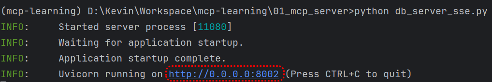

**2 运行客户端**

```
python sse_client.py http://localhost:8002/sse
```

运行输出如下（调用工具、获取提示模板内容、读取数据资源，均运行正常）：

```bash
INFO:httpx:HTTP Request: GET http://localhost:8002/sse "HTTP/1.1 200 OK"
INFO:httpx:HTTP Request: POST http://localhost:8002/messages/?session_id=8d09259e79504e5e9accf308bc06bcc5 "HTTP/1.1 202 Accepted"
INFO:httpx:HTTP Request: POST http://localhost:8002/messages/?session_id=8d09259e79504e5e9accf308bc06bcc5 "HTTP/1.1 202 Accepted"
INFO:httpx:HTTP Request: POST http://localhost:8002/messages/?session_id=8d09259e79504e5e9accf308bc06bcc5 "HTTP/1.1 202 Accepted"
------------列出全部 tools
---- 工具名称：add, 描述：加法运算

    参数:
    a: 第一个数字
    b: 第二个数字

    返回:
    两数之和
    
输入参数: {'properties': {'a': {'title': 'A', 'type': 'number'}, 'b': {'title': 'B', 'type': 'number'}}, 'required': ['a', 'b'], 'title': 'addArguments', 'type': 'object'}
---- 工具名称：subtract, 描述：减法运算

    参数:
    a: 第一个数字
    b: 第二个数字

    返回:
    两数之差 (a - b)
    
输入参数: {'properties': {'a': {'title': 'A', 'type': 'number'}, 'b': {'title': 'B', 'type': 'number'}}, 'required': ['a', 'b'], 'title': 'subtractArguments', 'type': 'object'}
---- 工具名称：multiply, 描述：乘法运算

    参数:
    a: 第一个数字
    b: 第二个数字

    返回:
    两数之积

输入参数: {'properties': {'a': {'title': 'A', 'type': 'number'}, 'b': {'title': 'B', 'type': 'number'}}, 'required': ['a', 'b'], 'title': 'multiplyArguments', 'type': 'object'}
---- 工具名称：divide, 描述：除法运算

    参数:
    a: 被除数
    b: 除数

    返回:
    两数之商 (a / b)

    异常:
    ValueError: 当除数为零时

输入参数: {'properties': {'a': {'title': 'A', 'type': 'number'}, 'b': {'title': 'B', 'type': 'number'}}, 'required': ['a', 'b'], 'title': 'divideArguments', 'type': 'object'}
INFO:httpx:HTTP Request: POST http://localhost:8002/messages/?session_id=8d09259e79504e5e9accf308bc06bcc5 "HTTP/1.1 202 Accepted"
工具执行结果：meta=None content=[TextContent(type='text', text='5.0', annotations=None, meta=None)] structuredContent={'result': 5.0} isError=False
INFO:httpx:HTTP Request: POST http://localhost:8002/messages/?session_id=8d09259e79504e5e9accf308bc06bcc5 "HTTP/1.1 202 Accepted"
------------列出全部 prompts
---- prompt 名称: introduce_china_province, 描述：介绍中国省份

    参数:
    province: 省份名称
    , 参数：[PromptArgument(name='province', description=None, required=True)]
INFO:httpx:HTTP Request: POST http://localhost:8002/messages/?session_id=8d09259e79504e5e9accf308bc06bcc5 "HTTP/1.1 202 Accepted"
-------介绍广东省的 prompt：
    请介绍这个省份：广东省

    要求介绍以下内容：
    1. 历史沿革
    2. 人文地理、风俗习惯
    3. 经济发展状况
    4. 旅游建议

INFO:httpx:HTTP Request: POST http://localhost:8002/messages/?session_id=8d09259e79504e5e9accf308bc06bcc5 "HTTP/1.1 202 Accepted"
---- 列出全部 resources
[Resource(name='list_tables', title=None, uri=AnyUrl('db://tables'), description='获取所有表名列表', mimeType='text/plain', size=None, annotations=None, meta=None)]
INFO:httpx:HTTP Request: POST http://localhost:8002/messages/?session_id=8d09259e79504e5e9accf308bc06bcc5 "HTTP/1.1 202 Accepted"
---- 列出全部 resource templates
[ResourceTemplate(name='get_table_data', title=None, uriTemplate='db://tables/{table_name}/data/{limit}', description='获取指定表的数据\n\n    参数:\n    table_name: 表名\n    ', mimeType=None, annotations
=None, meta=None), ResourceTemplate(name='get_table_schema', title=None, uriTemplate='db://tables/{table_name}/schema', description='获取表结构信息\n\n    参数:\n    table_name: 表名\n    ', mimeType=None, annotations=None, meta=None)]
INFO:httpx:HTTP Request: POST http://localhost:8002/messages/?session_id=8d09259e79504e5e9accf308bc06bcc5 "HTTP/1.1 202 Accepted"
---- 全部数据表：
["chinese_movie_ratings", "chinese_provinces"]
INFO:httpx:HTTP Request: POST http://localhost:8002/messages/?session_id=8d09259e79504e5e9accf308bc06bcc5 "HTTP/1.1 202 Accepted"
chinese_movie_ratings 表数据：
[{"movie_type": "剧情", "main_actors": "徐峥|王传君|周一围|谭卓|章宇", "region": "中国大陆", "director": "文牧野", "features": "经典", "rating": "8.9", "movie_name": "我不是药神"}, {"movie_type": "剧情", "
main_actors": "冯小刚|许晴|张涵予|刘桦|李易峰", "region": "中国大陆", "director": "管虎", "features": "经典", "rating": "7.8", "movie_name": "老炮儿"}, {"movie_type": "剧情", "main_actors": "王宝强|刘昊然|
肖央|刘承羽|尚语贤", "region": "中国大陆", "director": "陈思诚", "features": "经典", "rating": "6.7", "movie_name": "唐人街探案2"}, {"movie_type": "剧情", "main_actors": "任素汐|大力|刘帅良|裴魁山|阿如那",
 "region": "中国大陆", "director": "周申|刘露", "features": "经典", "rating": "8.3", "movie_name": "驴得水"}, {"movie_type": "剧情", "main_actors": "徐峥|王宝强|李曼|李小璐|左小青", "region": "中国大陆", "
director": "叶伟民", "features": "经典", "rating": "7.5", "movie_name": "人在囧途"}, {"movie_type": "剧情", "main_actors": "徐峥|黄渤|余男|多布杰|王双宝", "region": "中国大陆", "director": "宁浩", "feature
s": "经典", "rating": "8.1", "movie_name": "无人区"}, {"movie_type": "剧情", "main_actors": "姜文|香川照之|袁丁|姜宏波|丛志军", "region": "中国大陆", "director": "姜文", "features": "经典", "rating": "9.2"
, "movie_name": "鬼子来了"}, {"movie_type": "剧情", "main_actors": "章子怡|黄晓明|张震|王力宏|陈楚生", "region": "中国大陆", "director": "李芳芳", "features": "经典", "rating": "7.6", "movie_name": "无问西
"}, {"movie_type": "剧情", "main_actors": "彭于晏|廖凡|姜文|周韵|许晴", "region": "中国大陆", "director": "姜文", "features": "经典", "rating": "7.1", "movie_name": "邪不压正"}, {"movie_type": "剧情", "m main_actors": "肖央|王太利|韩秋池|于蓓蓓", "region": "中国大陆", "director": "肖央", "features": "经典", "rating": "8.5", "movie_name": "11度青春之"}]
```


## 第五章 MCP编程实战 - 实现数学运算智能问答应用


介绍如何整合前文实现的 MCP 服务端和 MCP 客户端（基于 SSE 传输协议），实现数学运算智能问答应用，该应用可实现以下功能：

1. **用户与大模型的交互式对话。**
2. **列出 MCP 服务端可用的全部工具 tool 的信息。**
3. **大模型根据用户的问题，判断是否要调用工具。若要调用工具，大模型给出工具调用的请求参数。**
4. **通过 MCP 客户端，对 MCP 服务端进行工具调用请求，并获取工具调用结果。**
5. **大模型结合工具调用结果，回答用户的问题。**

主要内容如下：

1. **主要对象关系、应用实现流程步骤**
2. **系统提示词（应用的关键，指导 LLM 如何与 MCP 服务进行交互）**
3. **编码实现**
4. **效果验证**


### 5.1 主要对象关系、应用实现流程步骤

#### 5.1.1 主要对象关系

- 会话管理：
  - 处理用户输入并展示AI响应
  - 维护对话历史记录
  - 协调LLM和MCP客户端之间的交互
  - 解析LLM响应中的工具调用请求
  - 处理工具执行结果并将其反馈给LLM
- 模型客户端：与大语言模型API通信的客户端。主要职责：封装与 LLM 服务的API交互；发送对话历史到LLM并获取响应。
- MCP客户端：与MCP服务端通信的客户端
- MCP服务端：提供工具服务的后端服务器

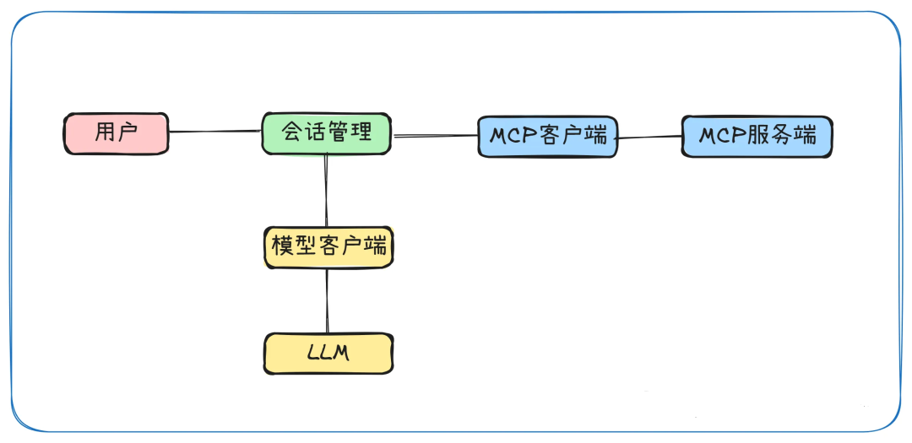

#### 5.1.2 流程步骤

1. 初始化阶段 - 建立MCP连接并获取工具列表
2. 交互循环 - 用户输入，LLM响应，工具调用处理
3. 工具调用处理 - 当LLM返回工具调用指令时的处理流程
4. 清理资源 - 程序退出时的资源清理

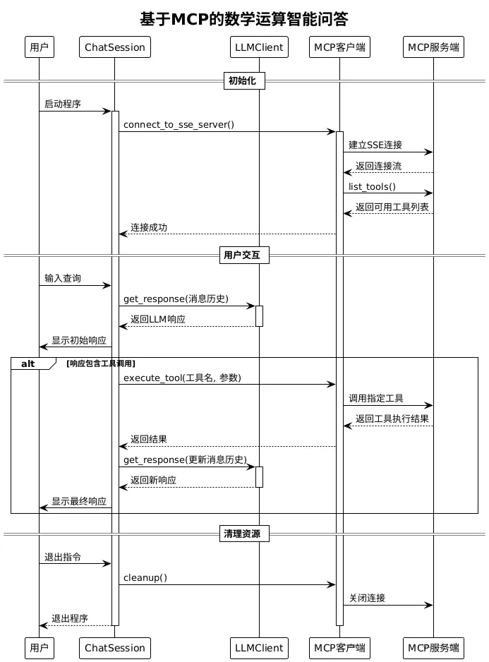

#### 5.1.3 系统提示词

**系统提示词是整个应用的关键部分，它指导 LLM 如何与 MCP 服务进行交互**。以下是经过笔者针对本应用的经过多次调试的系统提示词：

```python
# 系统提示，指导LLM如何使用工具和返回响应
        system_message = f'''
        你是一个智能助手，严格遵循以下协议返回响应：

        可用工具：{tools_description}

        响应规则：
        1、当需要计算时，返回严格符合以下格式的纯净JSON：
        {{
            "tool": "tool-name",
            "arguments": {{
                "argument-name": "value"
            }}
        }}
        2、禁止包含以下内容：
         - Markdown标记（如```json）
         - 自然语言解释（如"结果："）
         - 格式化数值（必须保持原始精度）
         - 单位符号（如元、kg）

        校验流程：
        ✓ 参数数量与工具定义一致
        ✓ 数值类型为number
        ✓ JSON格式有效性检查

        正确示例：
        用户：单价88.5买235个多少钱？
        响应：{{"tool":"multiply","arguments":{{"a":88.5,"b":235}}}}

        错误示例：
        用户：总金额是多少？
        错误响应：总价500元 → 含自然语言
        错误响应：```json{{...}}``` → 含Markdown

        3、在收到工具的响应后：
         - 将原始数据转化为自然、对话式的回应
         - 保持回复简洁但信息丰富
         - 聚焦于最相关的信息
         - 使用用户问题中的适当上下文
         - 避免简单重复使用原始数据
        '''
```


### 5.2 编码实现

`LLMClient`

```python
class LLMClient:
    """LLM客户端，负责与大语言模型API通信"""

    def __init__(self, model_name: str, url: str, api_key: str) -> None:
        self.model_name: str = model_name
        self.url: str = url
        self.client = OpenAI(api_key=api_key, base_url=url)

    def get_response(self, messages: list[dict[str, str]]) -> str:
        """发送消息给LLM并获取响应"""
        response = self.client.chat.completions.create(
            model=self.model_name,
            messages=messages,
            stream=False
        )
        return response.choices[0].message.content
```

`ChatSession`

```python
class ChatSession:
    """聊天会话，处理用户输入和LLM响应，并与MCP工具交互"""

    def __init__(self, llm_client: LLMClient, mcp_client: MCPClient, ) -> None:
        self.mcp_client: MCPClient = mcp_client
        self.llm_client: LLMClient = llm_client

    asyncdef cleanup(self) -> None:
        """清理MCP客户端资源"""
        try:
            await self.mcp_client.cleanup()
        except Exception as e:
            logging.warning(f"Warning during final cleanup: {e}")

    asyncdef process_llm_response(self, llm_response: str) -> str:
        """处理LLM响应，解析工具调用并执行"""
        try:
            # 尝试移除可能的markdown格式
            if llm_response.startswith('```json'):
                llm_response = llm_response.strip('```json').strip('```').strip()
            tool_call = json.loads(llm_response)
            if"tool"in tool_call and"arguments"in tool_call:
                # 检查工具是否可用
                tools = await self.mcp_client.list_tools()
                if any(tool.name == tool_call["tool"] for tool in tools):
                    try:
                        # 执行工具调用
                        result = await self.mcp_client.execute_tool(
                            tool_call["tool"], tool_call["arguments"]
                        )

                        returnf"Tool execution result: {result}"
                    except Exception as e:
                        error_msg = f"Error executing tool: {str(e)}"
                        logging.error(error_msg)
                        return error_msg
                returnf"No server found with tool: {tool_call['tool']}"
            return llm_response
        except json.JSONDecodeError:
            # 如果不是JSON格式，直接返回原始响应
            return llm_response

    asyncdef start(self, system_message) -> None:
        """启动聊天会话的主循环"""
        messages = [{"role": "system", "content": system_message}]
        whileTrue:
            try:
                # 获取用户输入
                user_input = input("用户: ").strip().lower()
                if user_input in ["quit", "exit", "退出"]:
                    print('AI助手退出')
                    break
                messages.append({"role": "user", "content": user_input})

                # 获取LLM的初始响应
                llm_response = self.llm_client.get_response(messages)
                print("助手: ", llm_response)

                # 处理可能的工具调用
                result = await self.process_llm_response(llm_response)

                # 如果处理结果与原始响应不同，说明执行了工具调用，需要进一步处理
                while result != llm_response:
                    messages.append({"role": "assistant", "content": llm_response})
                    messages.append({"role": "system", "content": result})

                    # 将工具执行结果发送回LLM获取新响应
                    llm_response = self.llm_client.get_response(messages)
                    result = await self.process_llm_response(llm_response)
                    print("助手: ", llm_response)

                messages.append({"role": "assistant", "content": llm_response})

            except KeyboardInterrupt:
                print('AI助手退出')
                break
```

`main`

```python
async def main():
    """主函数，初始化客户端并启动聊天会话"""
    mcp_client = MCPClient()
    # 初始化LLM客户端，使用通义千问模型
    llm_client = LLMClient(model_name='qwen-plus-latest', api_key=os.getenv('DASHSCOPE_API_KEY'),
                           url='https://dashscope.aliyuncs.com/compatible-mode/v1')
    try:
        # 连接到MCP服务器
        await mcp_client.connect_to_sse_server('http://localhost:8080/sse')
        chat_session = ChatSession(llm_client=llm_client, mcp_client=mcp_client)

        # 获取可用工具列表并格式化为系统提示的一部分
        tools = await mcp_client.list_tools()
        dict_list = [tool.__dict__ for tool in tools]
        tools_description = json.dumps(dict_list, ensure_ascii=False)

        # 系统提示，指导LLM如何使用工具和返回响应
        system_message = f'''
        你是一个智能助手，严格遵循以下协议返回响应：

        可用工具：{tools_description}

        响应规则：
        1、当需要计算时，返回严格符合以下格式的纯净JSON：
        {{
            "tool": "tool-name",
            "arguments": {{
                "argument-name": "value"
            }}
        }}
        2、禁止包含以下内容：
         - Markdown标记（如```json）
         - 自然语言解释（如"结果："）
         - 格式化数值（必须保持原始精度）
         - 单位符号（如元、kg）

        校验流程：
        ✓ 参数数量与工具定义一致
        ✓ 数值类型为number
        ✓ JSON格式有效性检查

        正确示例：
        用户：单价88.5买235个多少钱？
        响应：{{"tool":"multiply","arguments":{{"a":88.5,"b":235}}}}

        错误示例：
        用户：总金额是多少？
        错误响应：总价500元 → 含自然语言
        错误响应：```json{{...}}``` → 含Markdown

        3、在收到工具的响应后：
         - 将原始数据转化为自然、对话式的回应
         - 保持回复简洁但信息丰富
         - 聚焦于最相关的信息
         - 使用用户问题中的适当上下文
         - 避免简单重复使用原始数据
        '''
        # 启动聊天会话
        await chat_session.start(system_message)

    finally:
        # 确保资源被清理
        await chat_session.cleanup()


if __name__ == "__main__":
    asyncio.run(main())
```


### 5.3 效果验证

1. 运行 mcp 服务端（mcp 服务端，可阅读前文）
2. 本应用运行效果：

**模型可以根据用户的问题，正确地判断并调用工具，根据工具的调用结果，回答用户的问题**：

```bash
(mcp-learning) D:\Kevin\Workspace\mcp-learning\01_mcp_server>python math_compute.py

INFO:httpx:HTTP Request: POST http://localhost:8002/messages/?session_id=31e42dd53a0f45e79647948e66949a7d "HTTP/1.1 202 Accepted"
INFO:httpx:HTTP Request: POST http://localhost:8002/messages/?session_id=31e42dd53a0f45e79647948e66949a7d "HTTP/1.1 202 Accepted"

用户: 现在要购买一批货，单价是 1034.32423，数量是 235326。商家后来又说，可以在这个基础上，打95折，折后总价是多少？

INFO:httpx:HTTP Request: POST https://dashscope.aliyuncs.com/compatible-mode/v1/chat/completions "HTTP/1.1 200 OK"
助手:  {
  "tool": "multiply",
  "arguments": {
    "a": 1034.32423,
    "b": 235326
  }
}
INFO:httpx:HTTP Request: POST http://localhost:8002/messages/?session_id=31e42dd53a0f45e79647948e66949a7d "HTTP/1.1 202 Accepted"
INFO:httpx:HTTP Request: POST http://localhost:8002/messages/?session_id=31e42dd53a0f45e79647948e66949a7d "HTTP/1.1 202 Accepted"
INFO:httpx:HTTP Request: POST https://dashscope.aliyuncs.com/compatible-mode/v1/chat/completions "HTTP/1.1 200 OK"
INFO:httpx:HTTP Request: POST http://localhost:8002/messages/?session_id=31e42dd53a0f45e79647948e66949a7d "HTTP/1.1 202 Accepted"
INFO:httpx:HTTP Request: POST http://localhost:8002/messages/?session_id=31e42dd53a0f45e79647948e66949a7d "HTTP/1.1 202 Accepted"
助手:  {
  "tool": "multiply",
  "arguments": {
    "a": 243403383.74898,
    "b": 0.95
  }
}
INFO:httpx:HTTP Request: POST https://dashscope.aliyuncs.com/compatible-mode/v1/chat/completions "HTTP/1.1 200 OK"
助手:  折后总价是231233214.56153098。

用户: 我和商家关系比较好，商家说，可以在上面的基础上，再返回两个点，最后总价是多少？
INFO:httpx:HTTP Request: POST https://dashscope.aliyuncs.com/compatible-mode/v1/chat/completions "HTTP/1.1 200 OK"
助手:  {
  "tool": "multiply",
  "arguments": {
    "a": 231233214.56153098,
    "b": 0.98
  }
}
INFO:httpx:HTTP Request: POST http://localhost:8002/messages/?session_id=31e42dd53a0f45e79647948e66949a7d "HTTP/1.1 202 Accepted"
INFO:httpx:HTTP Request: POST http://localhost:8002/messages/?session_id=31e42dd53a0f45e79647948e66949a7d "HTTP/1.1 202 Accepted"
INFO:httpx:HTTP Request: POST https://dashscope.aliyuncs.com/compatible-mode/v1/chat/completions "HTTP/1.1 200 OK"
助手:  最后总价是226608550.27030036。

用户: quit
AI助手退出
```


## 第六章 FastMCP框架


介绍 FastMCP，**一个比官方 SDK 更好用的 python 框架。**

**相比官方 SDK，FastMCP的 API 设计更加简洁、开发效率更高，且具备更强的可扩展性，支持多种客户端/服务端传输模式（Stdio、SSE、内存）、资源模板机制，极大地降低了 MCP 服务器与客户端的开发门槛**。

使用 FastMCP 进行开发，最大的感悟是：**与官方 SDK 相比，FastMCP 极大地降低了客户端的开发成本（一句代码，即可创建 MCP 客户端）。**

本文是 MCP 系列文章的第六篇。本文的主要内容：

1. FastMCP 介绍
2. 开发示例：基于 FastMCP 的数学运算智能问答应用实现

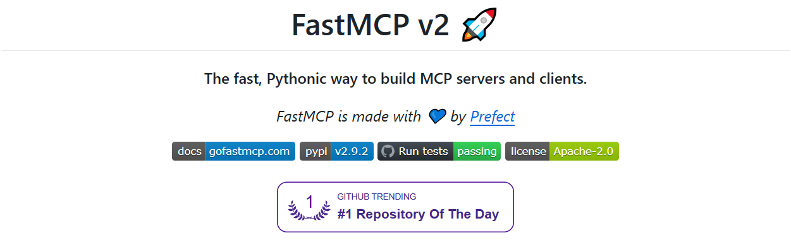

### 6.1 FastMCP介绍

- 项目地址：https://github.com/jlowin/fastmcp
- 项目文档地址：https://gofastmcp.com/getting-started/welcome

#### 6.1.1 FastMCP 与官方 SDK 的关系

FastMCP 是构建 MCP 服务器和客户端的标准框架。FastMCP 1.0 已被纳入官方 MCP Python SDK。

当前 FastMCP 已更新至 2.0 版本，2.0 版本通过引入完整的客户端支持、服务器组合、OpenAPI/FastAPI 集成、远程服务器代理、内置测试工具等功能，显著扩展了 1.0 版本的基础服务器构建能力。

#### 6.1.2 为什么选择FastMCP？

MCP 协议功能强大，但其实现涉及大量重复性工作——包括服务器设置、协议处理器、内容类型处理和错误管理等。FastMCP处理了所有复杂的协议细节和服务器管理，让开发者能专注于构建优质工具。其设计特点包括：

- 🪄 **高级抽象**：通常只需通过装饰器（Decorator）即可定义功能；
- 🌱 **延续性创新**：FastMCP 1.0的核心概念已被贡献给官方 MCP SDK，而FastMCP 2.0（当前项目）作为活跃开发的版本，新增了多项增强功能，包括：强大的客户端库、服务器代理与组合模式、OpenAPI/FastAPI集成、其他扩展能力。

#### 6.1.3 FastMCP的设计目标

- 🚀 **快速**：高级接口减少代码量，加速开发进程
- 🍀 **简洁**：以最小化样板代码构建MCP服务器
- 🐍 **符合Python习惯**：让Python开发者自然上手
- 🔍 **完整**：全面支持MCP核心规范的服务器和客户端实现


### 6.2 开发示例

#### 6.2.1 安装

运行以下命令，安装 FastMCP：

```
uv pip install fastmcp
```

#### 6.2.2 服务端实现

```python
from fastmcp import FastMCP

mcp = FastMCP(name="MyAssistantServer")


@mcp.tool()
def add(a: float, b: float) -> float:
    """加法运算

    参数:
    a: 第一个数字
    b: 第二个数字

    返回:
    两数之和
    """
    return a + b


@mcp.tool()
def subtract(a: float, b: float) -> float:
    """减法运算

    参数:
    a: 第一个数字
    b: 第二个数字

    返回:
    两数之差 (a - b)
    """
    return a - b


@mcp.tool()
def multiply(a: float, b: float) -> float:
    """乘法运算

    参数:
    a: 第一个数字
    b: 第二个数字

    返回:
    两数之积
    """
    return a * b


@mcp.tool()
def divide(a: float, b: float) -> float:
    """除法运算

    参数:
    a: 被除数
    b: 除数

    返回:
    两数之商 (a / b)

    异常:
    ValueError: 当除数为零时
    """
    if b == 0:
        raise ValueError("除数不能为零")
    return a / b


if __name__ == "__main__":
    mcp.run(transport='sse', host="127.0.0.1", port=8001)
```

#### 6.2.3 客户端实现

只需一行代码（指定连接到服务端的方式），即可创建 MCP 客户端：

```python
async def main():
    # 测试 mcp 客户端的功能
    async with Client("http://127.0.0.1:8001/sse") as mcp_client:
        tools = await mcp_client.list_tools()
        print(f"Available tools: {tools}")
        result = await mcp_client.call_tool("add", {"a": 5, "b": 3})
        print(f"Result: {result[0].text}")
```

#### 6.2.4 数学运算智能问答应用

基于 FastMCP 实现的数学运算智能问答应用实现如下（详细设计思路，可阅读第五章）

```python
class LLMClient:
    """LLM客户端，负责与大语言模型API通信"""

    def __init__(self, model_name: str, url: str, api_key: str) -> None:
        self.model_name: str = model_name
        self.url: str = url
        self.client = OpenAI(api_key=api_key, base_url=url)

    def get_response(self, messages: list[dict[str, str]]) -> str:
        """发送消息给LLM并获取响应"""
        response = self.client.chat.completions.create(
            model=self.model_name,
            messages=messages,
            stream=False
        )
        return response.choices[0].message.content


class ChatSession:
    """聊天会话，处理用户输入和LLM响应，并与MCP工具交互"""

    def __init__(self, llm_client: LLMClient, mcp_client: Client, ) -> None:
        self.mcp_client: Client = mcp_client
        self.llm_client: LLMClient = llm_client

    asyncdef process_llm_response(self, llm_response: str) -> str:
        """处理LLM响应，解析工具调用并执行"""
        try:
            # 尝试移除可能的markdown格式
            if llm_response.startswith('```json'):
                llm_response = llm_response.strip('```json').strip('```').strip()
            tool_call = json.loads(llm_response)
            if"tool"in tool_call and"arguments"in tool_call:
                # 检查工具是否可用
                tools = await self.mcp_client.list_tools()
                if any(tool.name == tool_call["tool"] for tool in tools):
                    try:
                        # 执行工具调用
                        result = await self.mcp_client.call_tool(
                            tool_call["tool"], tool_call["arguments"]
                        )

                        returnf"Tool execution result: {result}"
                    except Exception as e:
                        error_msg = f"Error executing tool: {str(e)}"
                        logging.error(error_msg)
                        return error_msg
                returnf"No server found with tool: {tool_call['tool']}"
            return llm_response
        except json.JSONDecodeError:
            # 如果不是JSON格式，直接返回原始响应
            return llm_response

    asyncdef start(self, system_message) -> None:
        """启动聊天会话的主循环"""
        messages = [{"role": "system", "content": system_message}]
        whileTrue:
            try:
                # 获取用户输入
                user_input = input("用户: ").strip().lower()
                if user_input in ["quit", "exit", "退出"]:
                    print('AI助手退出')
                    break
                messages.append({"role": "user", "content": user_input})

                # 获取LLM的初始响应
                llm_response = self.llm_client.get_response(messages)
                print("助手: ", llm_response)

                # 处理可能的工具调用
                result = await self.process_llm_response(llm_response)

                # 如果处理结果与原始响应不同，说明执行了工具调用，需要进一步处理
                while result != llm_response:
                    messages.append({"role": "assistant", "content": llm_response})
                    messages.append({"role": "system", "content": result})

                    # 将工具执行结果发送回LLM获取新响应
                    llm_response = self.llm_client.get_response(messages)
                    result = await self.process_llm_response(llm_response)
                    print("助手: ", llm_response)

                messages.append({"role": "assistant", "content": llm_response})

            except KeyboardInterrupt:
                print('AI助手退出')
                break


asyncdef main():
    asyncwith Client("http://127.0.0.1:8001/sse") as mcp_client:
        # 初始化LLM客户端，使用通义千问模型
        llm_client = LLMClient(model_name='qwen-plus-latest', api_key=os.getenv('DASHSCOPE_API_KEY'),
                               url='https://dashscope.aliyuncs.com/compatible-mode/v1')

        # 获取可用工具列表并格式化为系统提示的一部分
        tools = await mcp_client.list_tools()
        dict_list = [tool.__dict__ for tool in tools]
        tools_description = json.dumps(dict_list, ensure_ascii=False)

        # 系统提示，指导LLM如何使用工具和返回响应
        system_message = f'''
                你是一个智能助手，严格遵循以下协议返回响应：

                可用工具：{tools_description}

                响应规则：
                1、当需要计算时，返回严格符合以下格式的纯净JSON：
                {{
                    "tool": "tool-name",
                    "arguments": {{
                        "argument-name": "value"
                    }}
                }}
                2、禁止包含以下内容：
                 - Markdown标记（如```json）
                 - 自然语言解释（如"结果："）
                 - 格式化数值（必须保持原始精度）
                 - 单位符号（如元、kg）

                校验流程：
                ✓ 参数数量与工具定义一致
                ✓ 数值类型为number
                ✓ JSON格式有效性检查

                正确示例：
                用户：单价88.5买235个多少钱？
                响应：{{"tool":"multiply","arguments":{{"a":88.5,"b":235}}}}

                错误示例：
                用户：总金额是多少？
                错误响应：总价500元 → 含自然语言
                错误响应：```json{{...}}``` → 含Markdown

                3、在收到工具的响应后：
                 - 将原始数据转化为自然、对话式的回应
                 - 保持回复简洁但信息丰富
                 - 聚焦于最相关的信息
                 - 使用用户问题中的适当上下文
                 - 避免简单重复使用原始数据
                '''
        # 启动聊天会话
        chat_session = ChatSession(llm_client=llm_client, mcp_client=mcp_client)
        await chat_session.start(system_message=system_message)

if __name__ == "__main__":
    asyncio.run(main())
```

#### 6.2.5 运行验证

1. 运行服务端：python fast_mcp_server.py

   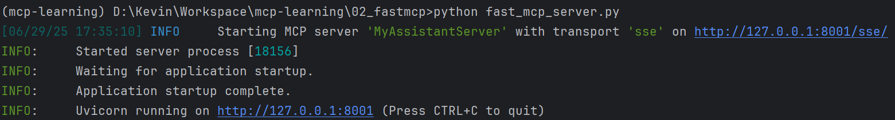

2. 运行数学运算智能问答应用

   ```bash
   python fast_mcp_client.py
   ```

   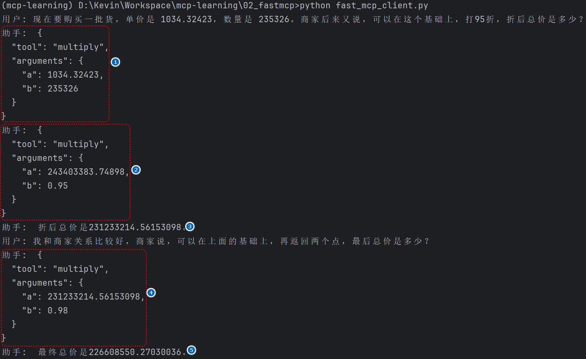


## 第七章 MCP 的 Sampling（采样），赋予 MCP 服务端智能能力！


**MCP 服务端在实现其功能时，是否可借助 LLM 的能力？本章介绍了 MCP 的一项核心内容：Sampling（采样）**。

本章的主要内容：

1. 为什么需要 Sampling
2. Sampling 的流程步骤
3. 请求消息格式与参数
4. 最佳实践建议

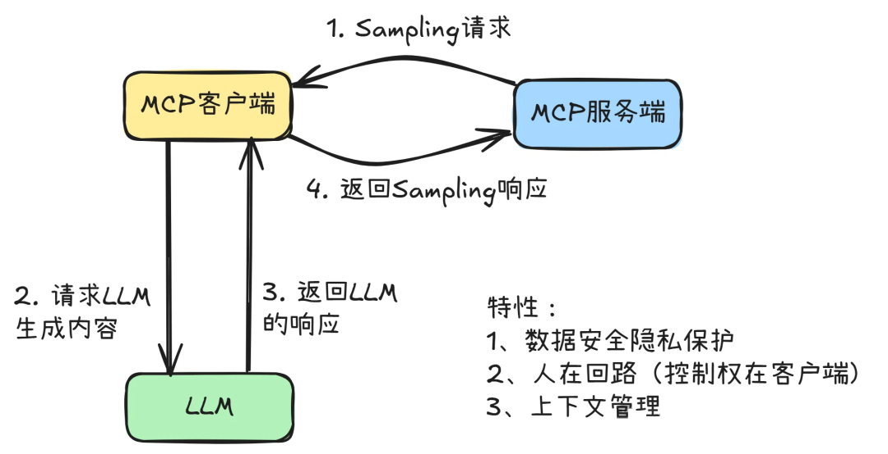


### 7.1 为什么需要 Sampling

**Sampling（采样）是 MCP 的一项核心功能，它允许服务端通过客户端请求 LLM 生成内容，实现复杂的智能体行为，同时兼顾安全性和隐私性。具体来说，即服务端可主动向客户端发起 LLM 生成请求。这种“反向调用”机制让服务端无需直接访问模型 API，即可利用客户端的 LLM 能力**。

大家可能会有疑问：根据 MCP 协议，客户端可直接与 LLM 交互，为什么要让服务端向客户端发起请求，客户端再将请求转发到 LLM（服务端 -> 客户端 -> LLM） ？为什么不是让客户端直接向 LLM 发起请求 （客户端 -> LLM）？**Sampling 的这种调用请求机制（服务端 -> 客户端 -> LLM），主要基于以下设计逻辑的**：

- MCP 服务端是整合多源数据的协调者，将多个工作处理步骤编排，形成一个特定的功能服务暴露给客户端（服务形式可以是工具、资源、提示模板等）。MCP 服务端在实现其功能时，可能需要借助 LLM 的能力，以增强其处理能力。因此，**当服务端在功能实现过程中需要借助 LLM 的能力时，由服务端作为请求的发起者（服务端 -> 客户端 -> LLM），是合理的**。
- **根据 MCP 的设计理念，服务端提供外部的工具或资源服务，并不直接与 LLM 交互**。因此，**服务端需要将请求发给客户端，客户端再将请求转发到 LLM（服务端 -> 客户端 -> LLM）**。

通过 Sampling 机制，MCP 在赋予服务端智能能力的同时，将最终控制权保留在用户手中（客户端），**实现了安全性与功能性的平衡**。这种设计特别适用于医疗、金融等对数据隐私要求极高的领域：

1. **🛡️ 安全隐私保护**
   - 允许服务端请求 LLM 生成内容，但实际执行权在客户端。
   - 用户可审查/修改所有请求和输出，防止敏感数据泄露。
2. **🧑💻 人机交互（Human-in-the-loop）**：客户端（用户）成为关键决策节点。
3. **🧠 上下文管理**：客户端决定了哪些上下文（如果有的话）最终会被实际包含在发送给 LLM 的提示中。这确保了用户隐私和上下文信息的安全共享。上下文范围控制有三个参数选项：**none（不共享任何上下文）、thisServer（仅当前服务器上下文）、allServers（跨服务全上下文共享）**。
4. **⚖️ LLM 模型选择**
   - 服务端可建议模型（如 "claude-3"），但客户端掌握最终决定权。
   - 客户端根据成本/速度/性能优先级动态选择最合适的模型。


### 7.2 Sampling 的流程步骤

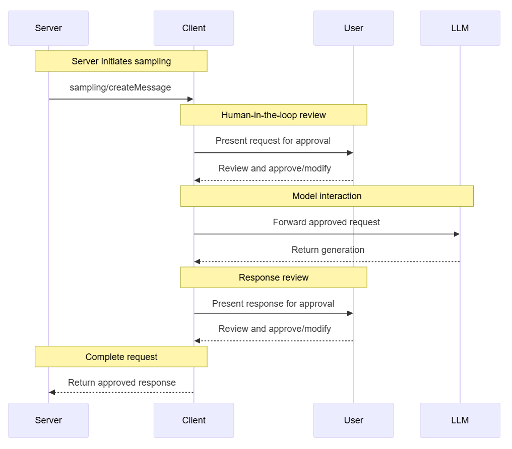

1. 服务端发送 sampling/createMessage 请求
2. 客户端审查并可选修改请求
3. 客户端调用 LLM 生成内容
4. 客户端审查生成结果
5. 返回最终结果给服务器

在上述的流程中，客户端可以对以下内容进行控制。控制权掌握在用户手中，实现了安全性与功能性的平衡。

| 控制层级 | 服务端能力     | 客户端权利       |
| :------- | :------------- | :--------------- |
| 提示词   | 建议初始提示   | 修改/拒绝提示    |
| 上下文   | 请求上下文范围 | 决定实际包含内容 |
| 模型选择 | 推荐模型       | 最终选择模型     |
| 输出结果 | 接收结果       | 修改/过滤输出    |


### 7.3 请求消息格式与参数

请求消息格式：

```json
{
  messages: [
    {
      role: "user" | "assistant",
      content: {
        type: "text" | "image",

        // For text:
        text?: string,

        // For images:
        data?: string,             // base64 encoded
        mimeType?: string
      }
    }
  ],
  modelPreferences?: {
    hints?: [{
      name?: string                // Suggested model name/family
    }],
    costPriority?: number,         // 0-1, importance of minimizing cost
    speedPriority?: number,        // 0-1, importance of low latency
    intelligencePriority?: number  // 0-1, importance of capabilities
  },
  systemPrompt?: string,
  includeContext?: "none" | "thisServer" | "allServers",
  temperature?: number,
  maxTokens: number,
  stopSequences?: string[],
  metadata?: Record<string, unknown>
}
```

**参数说明**：

1. role: 消息发送者角色。
   - user: 代表用户消息。
   - assistant: 代表助理（LLM）消息。
2. content: 消息内容，文本或图像。
3. **模型偏好**（modelPreferences ）：服务端向客户端表达其对模型选择的偏好，但最终决定权在客户端。客户端最终根据这些偏好、自身可用模型列表、用户设置和策略来选择实际使用的模型。
   - hints (数组，可选): 模型名称建议列表，客户端可用于选择模型。数组中的多个提示按顺序评估优先级（索引0优先级最高）。
   - 优先级值 (0-1 标准化，可选): 客户端在权衡选择时应考虑的偏好权重，分别有 **costPriority (成本优先级）、speedPriority (速度优先级）、intelligencePriority (智能/能力优先级）** 三项可选。
4. systemPrompt: 服务端可以请求使用特定的系统提示词（System Prompt）来指导 LLM 的行为（如角色设定、输出格式要求等）。客户端可能修改或完全忽略此提示词。用户或客户端策略可能会覆盖此设置。
5. includeContext：指定服务端希望客户端在生成请求时包含哪些额外的 MCP Context 信息，有 **none（不共享任何上下文）、thisServer（仅当前服务器上下文）、allServers（跨服务全上下文共享）**三项可选。
6. parameters（可选）：设置向 LLM 请求的 `temperature`、最大 tokens 数 `maxTokens` 等参数。


### 7.4 响应格式

客户端返回完成的结果

```json
{
  model: string,  // Name of the model used
  stopReason?: "endTurn" | "stopSequence" | "maxTokens" | string,
  role: "user" | "assistant",
  content: {
    type: "text" | "image",
    text?: string,
    data?: string,
    mimeType?: string
  }
}
```


### 7.5 请求示例

以下是向客户请求采样的示例：

```json
{
  "method": "sampling/createMessage",
  "params": {
    "messages": [
      {
        "role": "user",
        "content": {
          "type": "text",
          "text": "What files are in the current directory?"
        }
      }
    ],
    "systemPrompt": "You are a helpful file system assistant.",
    "includeContext": "thisServer",
    "maxTokens": 100
  }
}
```


### 7.6 Sampling 的最佳实践建议

1. 💬 提供清晰、结构化的提示：始终设计逻辑严谨、目标明确的提示词，确保模型理解任务意图。
2. 🖼️ 妥善处理文本与图像内容：支持多模态输入（如 Base64 编码图像），并验证内容格式兼容性。
3. ⏳ 设置合理的令牌限制：通过 maxTokens 参数控制生成长度，避免资源浪费或截断风险。
4. 🌐 通过 includeContext 包含相关上下文：按需选择上下文范围（none/thisServer/allServers），提升生成准确性。
5. 🔍 使用前验证响应内容：检查响应完整性及潜在偏见，过滤敏感信息后再交付。
6. ⚠️ 优雅处理错误：实现超时重试、降级回退等机制，避免单点故障影响系统。
7. 🚦 考虑对采样请求限流：基于业务优先级配置速率限制（如 Token Bucket 算法），防止资源过载。
8. 📝 文档化预期的采样行为：明确记录模型兼容性、上下文依赖等约束，降低集成成本。
9. 🧪 用不同模型参数测试：调整 temperature、stopSequences 等参数，验证生成稳定性。
10. 📊 监控采样成本：记录模型调用频次与令牌消耗，优化资源分配策略。


## 第八章 基于 MCP 的数据智能查询应用实现（利用 Sampling 实现微博内容的情感分析）

**情感分析（Sentiment Analysis）也称情绪识别**，是自然语言处理（NLP）中的核心任务之一。

早期的方法多基于词典、关键词匹配，例如：

- 用正面词列表（“好”，“喜欢”）和负面词列表（如 “差”，“讨厌”）计算情感倾向
- 使用简单的机器学习模型（如朴素贝叶斯、SVM）进行文本分类

这些方法虽然简单直观，但存在明显不足：

- **无法理解上下文**：同样一个词在不同语境下可能情感截然相反
- **难以处理讽刺、否定、隐含情绪等复杂语言现象**
- **对新词、行业术语缺乏适应性**

随着深度学习的发展，尤其是 Transformer 架构的引入，情感分析模型从关键词识别走向了上下文理解，

BERT（Bidirectional Encoder Representations from Transformer）是这一转变的关键节点。BERT是由Google于2018年提出，基于双向 Transformer 编码器结构，特点如下：

- **双向语境建模：**不同于传统的从左到右或从右到左语言模型，BERT同时考虑一个词的左右上下文
- **预训练+微调机制：**先在大规模语料库上无监督训练（预训练），再根据任务（如情感分析）进行有监督微调
- **上下文表示：**每个词的向量不仅仅取决于词义本身，还取决于它在句子中的位置和语义关系


本章从开发的角度，介绍如何通过 Sampling，赋予 MCP 服务端智能能力。

本章以数据智能查询应用场景为例，该应用基于 LLM、MCP 实现以下功能：

1. 用户以自然语言的形式提问，LLM 识别用户提问意图，并通过 MCP 查询对应的数据库数据，结合数据查询结果回答用户问题。
2. 通过 MCP 的 Sampling，赋予 MCP 服务端智能能力：服务端在查询微博数据时，分析并返回每条微博内容的情感倾向。


### 8.1 实体对象关系

假设应用场景有三类数据：中国省份信息、电影数据、微博数据。

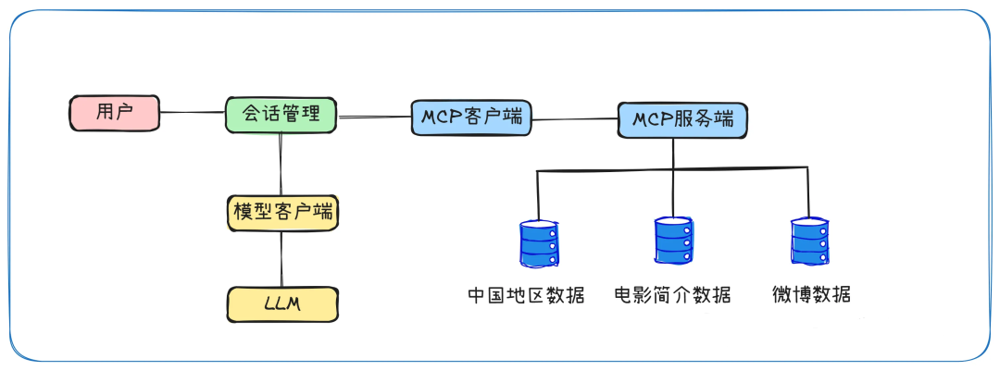

主要对象关系如上图所示，**此处 MCP 服务端暴露的是资源 resources 服务，提供数据库数据查询服务)**：

- **会话管理**：
  - 处理用户输入，返回 LLM 的响应；
  - 维护对话历史记录；
  - 协调LLM和MCP客户端之间的交互；
  - 解析LLM响应中的数据资源调用请求；
  - 将MCP返回的数据资源结果反馈给LLM；
- **模型客户端**：与大语言模型API通信的客户端。主要职责：封装与 LLM 服务的API交互；发送对话历史到LLM并获取响应。
- **MCP客户端**：与MCP服务端通信的客户端
- **MCP服务端**：提供数据资源服务的后端服务器，可提供中国地区数据、电影数据、微博数据三类数据。


### 8.2 利用 Sampling 实现微博内容的情感分析

通过 Sampling，MCP 服务端在提供微博数据查询服务时，可以借助 LLM 能力，实现对微博内容的情感分析，并将分析结果返回给用户。

通过 Sampling 实现微博内容情感分析流程如下：

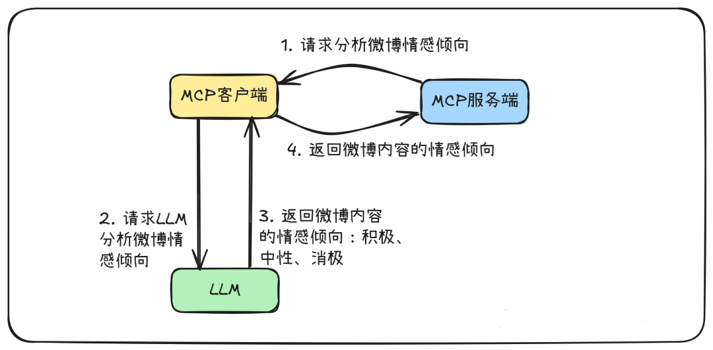

基于 FastMCP 的 Sampling 实现：

- MCP 服务端获取 Context 上下文对象，调用 Context 对象的 sample 方法，发起 Samping 请求并获取结果。
- 在定义 MCP 服务端方法时，Context 对象是通过依赖注入的方式自动注入的（当定义资源处理函数时，如果参数中包含 ctx: Context，FastMCP 会自动注入 Context 实例，不需要手动创建 Context 对象）。
- sampling_handler 作为一个回调函数，注册到 MCP Client 中。sampling_handler 用于处理向 LLM 的 Sampling 请求。

Sampling 的交互流程：


### 8.3 编码实现

#### 8.3.1 服务端

中国地区数据、电影数据查询服务：

```python
@mcp.resource("db://province_info/data/{province_name}")
asyncdef get_province_data(province_name: str) -> str:
    """中国省份（含直辖市）信息

    参数:
    province_name: 中国省份名称或直辖市，如广东省，北京市

    返回:
    以 json 格式返回某省份信息
    """
    sql = '''
            select region_code,
                   province_name,
                   capital_city,
                   area,
                   population,
                   abbreviation 
            from public.chinese_provinces 
            where province_name = '{province_name}'
    '''.format(province_name=province_name)
    with get_db_connection() as conn:
        with conn.cursor(cursor_factory=RealDictCursor) as cur:
            cur.execute(sql)
            rows = cur.fetchall()
            return json.dumps(list(rows), default=str)


@mcp.resource("db://movie_info/data/{movie_name}")
asyncdef get_movie_data(movie_name: str) -> str:
    """电影信息

    参数:
    movie_name: 电影名称

    返回:
    以 json 格式返回某电影信息
    """
    sql = '''
    select movie_type, 
           main_actors, 
           region, 
           director, 
           features, 
           rating, 
           movie_name
    from public.chinese_movie_ratings
    where movie_name = '{movie_name}'
    '''.format(movie_name=movie_name)
    with get_db_connection() as conn:
        with conn.cursor(cursor_factory=RealDictCursor) as cur:
            cur.execute(sql)
            rows = cur.fetchall()
            return json.dumps(list(rows), default=str)
```

微博数据查询（调用上下文对象的 sample 方法，获取每条微博的情感倾向）：

```python
@mcp.resource("db://weibo_data/data/?date={date}&limit={limit}")
asyncdef get_weibo_data(ctx: Context, date: str, limit: int = 10,) -> str:
    """微博数据

    参数:
    date: 日期，数据格式为 yyyymmdd
    limit: 要求返回的数据量

    返回:
    以 json 格式返回微博数据
    """
    sql = f'''
            select weibo_id,
                   user_name,
                   publish_date,
                   publish_time,
                   weibo_content 
            from public.t_weibo_ncov
            where publish_date = '{date}'
            limit {limit}
    '''.format(date=date, limit=limit)
    with get_db_connection() as conn:
        with conn.cursor(cursor_factory=RealDictCursor) as cur:
            cur.execute(sql)
            rows = cur.fetchall()

            # 通过 Sampling，给每个微博内容增加情感倾向标签
            for weibo_data in rows:
                system_prompt = '请给出这条微博内容的情感倾向，标注分为三类的其中一个：积极，中性和消极'
                response = await ctx.sample(
                    messages=weibo_data['weibo_content'],
                    system_prompt=system_prompt
                )
                assert isinstance(response, TextContent)
                weibo_data['sentiment_tag'] = response.text
                print(weibo_data)
            return json.dumps(list(rows), default=str)


@mcp.resource("db://weibo_data/data/?weibo_user={weibo_user}&limit={limit}")
asyncdef get_weibo_user_data(ctx: Context, weibo_user: str, limit: int = 10,) -> str:
    """某具体微博用户名的微博内容

    参数:
    weibo_user: 微博用户名
    limit: 要求返回的数据量

    返回:
    以 json 格式返回微博数据
    """
    sql = '''
            select weibo_id,
                   user_name,
                   publish_date,
                   publish_time,
                   weibo_content 
            from public.t_weibo_ncov
            where user_name = '{weibo_user}'
            limit {limit}
    '''.format(weibo_user=weibo_user, limit=limit)
    with get_db_connection() as conn:
        with conn.cursor(cursor_factory=RealDictCursor) as cur:
            cur.execute(sql)
            rows = cur.fetchall()

            # 通过 Sampling，给每个微博内容增加情感倾向标签
            for weibo_data in rows:
                system_prompt = '请给出这条微博内容的情感倾向，标注分为三类的其中一个：积极，中性和消极'
                response = await ctx.sample(
                    messages=weibo_data['weibo_content'],
                    system_prompt=system_prompt
                )
                assert isinstance(response, TextContent)
                weibo_data['sentiment_tag'] = response.text
                print(weibo_data)
            return json.dumps(list(rows), default=str)
```

服务端设置与运行：

```python
mcp = FastMCP("weibo data mcp server",
              debug=True,
              host="0.0.0.0",
              port=8002)

if __name__ == "__main__":
    mcp.run("sse")
```

#### 8.3.2 客户端

会话管理：

```python
class LLMClient:
    """大语言模型客户端，负责与LLM API进行通信"""

    def __init__(self, model_name: str, url: str, api_key: str) -> None:
        """
        初始化LLM客户端

        Args:
            model_name: 模型名称
            url: API基础URL
            api_key: API密钥
        """
        self.model_name: str = model_name
        self.url: str = url
        self.client = OpenAI(api_key=api_key, base_url=url)

    def get_response(self, messages: list[dict[str, str]]) -> str:
        """
        向LLM发送消息并获取响应

        Args:
            messages: 消息列表，每条消息包含role和content

        Returns:
            LLM的响应文本
        """
        response = self.client.chat.completions.create(
            model=self.model_name,
            messages=messages,
            stream=False
        )
        return response.choices[0].message.content


class ChatSession:
    """聊天会话管理器，处理用户输入、LLM响应和资源访问"""

    def __init__(self, llm_client: LLMClient, mcp_client: Client) -> None:
        """
        初始化聊天会话

        Args:
            llm_client: LLM客户端实例
            mcp_client: MCP客户端实例，用于访问资源
        """
        self.mcp_client: Client = mcp_client
        self.llm_client: LLMClient = llm_client

    asyncdef process_llm_response(self, llm_response: str) -> str:
        """
        处理LLM的响应，解析资源URI调用或工具调用并执行

        Args:
            llm_response: LLM返回的响应文本

        Returns:
            处理后的响应文本，包含资源数据或工具执行结果
        """
        try:
            # 检查是否为资源URI调用（以db://开头）
            if llm_response.strip().startswith('db://'):
                uri = llm_response.strip()
                try:
                    # 执行资源读取
                    resource_data = await self.mcp_client.read_resource(uri=uri)
                    return f"Resource data: {resource_data}"
                except Exception as e:
                    error_msg = f"Error reading resource: {str(e)}"
                    logging.error(error_msg)
                    return error_msg
            else:
                # 尝试解析为JSON工具调用（保留兼容性）
                if llm_response.startswith('```json'):
                    llm_response = llm_response.strip('```json').strip('```').strip()
                try:
                    tool_call = json.loads(llm_response)
                    if "tool" in tool_call and "arguments" in tool_call:
                        # 检查工具是否可用
                        available_tools = await self.mcp_client.list_tools()
                        if any(tool.name == tool_call["tool"] for tool in available_tools):
                            try:
                                # 执行工具调用
                                tool_result = await self.mcp_client.call_tool(
                                    tool_call["tool"], tool_call["arguments"]
                                )
                                return f"Tool execution result: {tool_result}"
                            except Exception as e:
                                error_msg = f"Error executing tool: {str(e)}"
                                logging.error(error_msg)
                                return error_msg
                        return f"Tool not found: {tool_call['tool']}"
                except json.JSONDecodeError:
                    pass
                # 如果不是JSON格式或工具调用，直接返回原始响应
                return llm_response
        except Exception as e:
            error_msg = f"Error processing LLM response: {str(e)}"
            logging.error(error_msg)
            return error_msg

    asyncdef start(self, system_message: str) -> None:
        """
        启动聊天会话的主循环

        Args:
            system_message: 系统提示消息，指导LLM的行为
        """
        messages = [{"role": "system", "content": system_message}]
        whileTrue:
            try:
                # 获取用户输入
                user_input = input("用户: ").strip().lower()
                if user_input in ["quit", "exit", "退出"]:
                    print('AI助手已退出')
                    break
                messages.append({"role": "user", "content": user_input})

                # 获取LLM的初始响应
                llm_response = self.llm_client.get_response(messages)
                print("助手: ", llm_response)

                # 处理可能的资源调用或工具调用
                result = await self.process_llm_response(llm_response)

                # 如果处理结果与原始响应不同，说明执行了资源调用或工具调用，需要进一步处理
                while result != llm_response:
                    messages.append({"role": "assistant", "content": llm_response})
                    messages.append({"role": "system", "content": result})

                    # 将资源数据或工具执行结果发送回LLM获取新响应
                    llm_response = self.llm_client.get_response(messages)
                    result = await self.process_llm_response(llm_response)
                    print("助手: ", llm_response)

                messages.append({"role": "assistant", "content": llm_response})

            except KeyboardInterrupt:
                print('AI助手已退出')
                break
```

Sampling：通过 marvin 框架，创建 Agent，负责处理向 LLM 的 Sampling 请求

```python
# 获取DeepSeek API密钥
api_key = os.getenv('DEEPSEEK_API_KEY')

# 初始化DeepSeek模型
model = OpenAIModel(
    'deepseek-chat',
    provider=DeepSeekProvider(api_key=api_key),
)

# 创建Marvin智能助手
agent = marvin.Agent(
    model=model,
    name="智能助手"
)


asyncdef sampling_func(
        messages: list[SamplingMessage],
        params: SamplingParams,
        ctx: RequestContext,
) -> str:
    """
    采样函数，用于处理消息并获取LLM响应

    Args:
        messages: 消息列表
        params: 采样参数
        ctx: 请求上下文

    Returns:
        LLM的响应文本
    """
    return await marvin.say_async(
        message=[m.content.text for m in messages],
        instructions=params.systemPrompt,
        agent=agent
    )
```

main 函数：

```python
async def main():
    """主函数，初始化客户端并启动聊天会话"""
    asyncwith Client("http://127.0.0.1:8002/sse", sampling_handler=sampling_func) as mcp_client:
        # 初始化LLM客户端，使用通义千问模型
        llm_client = LLMClient(
            model_name='qwen-plus-latest',
            api_key=os.getenv('DASHSCOPE_API_KEY'),
            url='https://dashscope.aliyuncs.com/compatible-mode/v1'
        )

        # 获取可用资源模板
        resource_templates = await mcp_client.list_resource_templates()
        template_dicts = [template.__dict__ for template in resource_templates]
        resources_description = json.dumps(template_dicts, ensure_ascii=False)

        # 系统提示，指导LLM如何使用资源模板和返回响应
        system_message = f'''
                你是一个智能助手，能够访问多种数据资源。严格遵循以下协议返回响应：

                可用资源模板：{resources_description}

                响应规则：
                1、当用户询问需要查询数据时，判断是否需要调用资源模板：
                 - 如果需要查询数据，返回对应的资源URI
                 - 如果是普通对话，直接回答用户问题

                2、资源调用格式：
                 - 返回纯净的URI字符串，不包含任何其他内容
                 - URI格式必须严格按照资源模板定义
                 - 根据用户需求填入合适的参数值
                 
                3、URI参数说明：
                 - date: 日期参数，格式如0101表示1月1日
                 - limit: 限制返回数据条数
                 - 其他参数根据资源模板定义填入

                4、非数据查询的响应：
                 - 对于普通对话，直接给出自然语言回答
                 - 不需要调用资源时，不要返回URI

                5、收到资源数据后：
                 - 将数据转化为用户友好的格式
                 - 突出显示关键信息
                 - 保持回复简洁清晰
                 - 根据用户问题提供相关分析
                '''
        # 启动聊天会话
        chat_session = ChatSession(llm_client=llm_client, mcp_client=mcp_client)
        await chat_session.start(system_message=system_message)
```


### 8.4 运行效果

1 运行服务端：`python weibo_data_server.py`

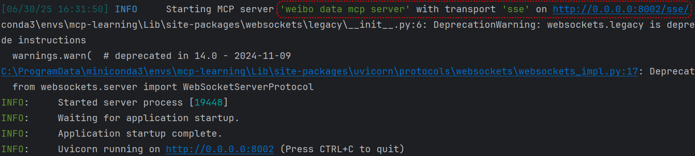

2 运行客户端：`python weibo_data_client.py` ，进入会话，用户提问：

- 介绍一下北京市
- 介绍一下电影我不是药神
- 获取1月1日前两条微博
- 获取微博用户“是快乐小张张”的微博

下面的运行结果显示，**LLM 可根据用户的提问，转换为相应的数据查询（通过 MCP 查询外部数据资源），并根据查询结果，回答用户的问题。微博数据的查询返回，提供了每条微博的情感倾向（利用 MCP Sampling 实现微博内容的情感分析）**:

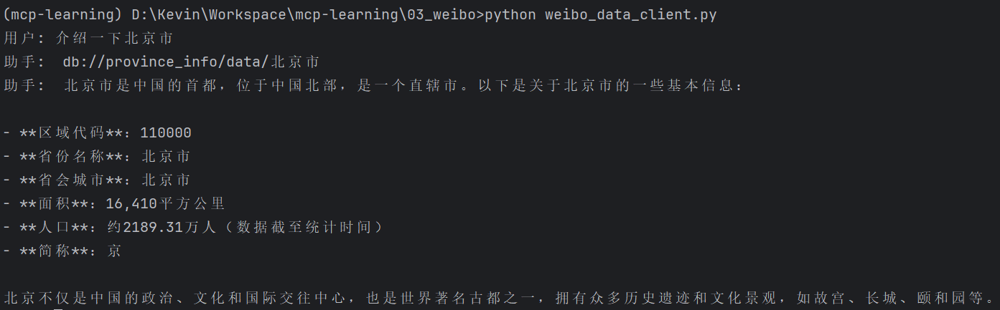

```markdown
用户: 介绍一下北京市
助手:  db://province_info/data/北京市
助手:  北京市是中国的首都，位于中国北部，是一个直辖市。以下是关于北京市的一些基本信息：
- **区域代码**：110000
- **省份名称**：北京市
北京不仅是中国的政治、文化和国际交往中心，也是世界著名古都之一，拥有众多历史遗迹和文化景观，如故宫、长城、颐和园等。
用户: 介绍一下电影我不是药神
北京不仅是中国的政治、文化和国际交往中心，也是世界著名古都之一，拥有众多历史遗迹和文化景观，如故宫、长城、颐和园等。

用户: 介绍一下电影我不是药神
助手:  db://movie_info/data/我不是药神
助手:  电影《我不是药神》是一部感人至深的中国大陆剧情片，由文牧野执导，徐峥、王传君、周一围、谭卓、章宇等主演。以下是该电影的关键信息：

- **电影类型**：剧情
- **地区**：中国大陆
- **导演**：文牧野
- **主要演员**：徐峥 | 王传君 | 周一围 | 谭卓 | 章宇
- **影片特色**：经典
- **豆瓣评分**：8.9分（高口碑佳作）

这部电影改编自真实事件，讲述了一位普通药店老板程勇在帮助白血病患者购买低价救命药的过程中，经历道德与法律冲突的故事。影片深刻反映了社会现实问题，并引发了广泛讨论。

如果你喜欢具有深度和社会意义的电影，《我不是药神》非常值得观看！

用户: 获取1月1日前两条微博
助手:  db://weibo_data/data/?date=0101&limit=2
助手:  以下是2020年1月1日发布的前两条微博内容：

1. **用户**：_n-fairy
   **时间**：00:00
   **内容**：2019年过去了，所有不好的都忘记吧……2020年已经来了，所有愿望都许在新年这一天吧……2020中考顺利，家人身体健康，国家越来越强大？
   **情感标签**：积极

2. **用户**：黄大喵的金油瓶
   **时间**：00:42
   **内容**：这新年的祝福，手长的我先给利利送到。@齐木心美冲鸭（因为我预测零点的服务器会崩溃hhhhh～）本号的第一条原创！！献给你！！！味味道正可耐的利利同学在新的一年里也 要好好加油哦～回想起与利利认识的第一天；和利利交谈的第一句话；和利利坐在一节课堂……我都记不得了⊙_⊙??
   **情感标签**：积极

这两条微博都展现了用户对新年的期待和美好祝愿，整体情感倾向积极。

用户: 获取微博用户“是快乐小张张”的微博
助手:  db://weibo_data/data/?weibo_user=是快乐小张张&limit=10
助手:  以下是微博用户“是快乐小张张”最近发布的一条微博内容：

**发布时间**：02月03日 17:52
**微博内容**：终于哭了不再为自己的小小世界。我与疫情的关系是不想延迟开学的我，希望它快快过去，痛恨它阻挡了我的感情。在这段时间里，外面的世界纷纷扰扰，我在小小世界伸手不见指，我甚至羡慕那些为了疫情新闻义务填报的人，至少还有心情关注外面的世界。孔维的视频我看到亲情：采访时一个顶天立地医生他想……
**情感标签**：消极

这条微博反映出了用户对疫情带来影响的无奈和压抑情绪，整体情感倾向较为消极。

用户: quit
AI助手已退出
```


## 第九章 学习 MCP 的有效途径：借鉴优秀的 MCP 服务端与客户端实现


本章介绍两个列举了优秀 MCP 服务端和客户端的 github 项目：**awesome-mcp-servers** 和 **awesome-mcp-clients**，是**学习 MCP 不可多得的资源**。这两个项目分别展示了当前流行的 MCP 服务端和客户端，研究这些优秀案例，对开发者和终端用户，都具有重要的参考价值。

1. **对于开发者**：
   - **学习不同的 MCP 服务端、客户端的实现，了解 MCP 生态，寻找灵感和最佳实践，积累开发经验**。
   - **根据实际情况，选择合适的开源 MCP 服务端和客户端，集成到开发项目中**。
2. **对于终端用户**：
   - **探索并尝试使用优秀的 MCP 服务端和客户端，提高日常的办公效率**。

### 9.1 awesome-mcp-servers

项目地址：https://github.com/punkpeye/awesome-mcp-servers

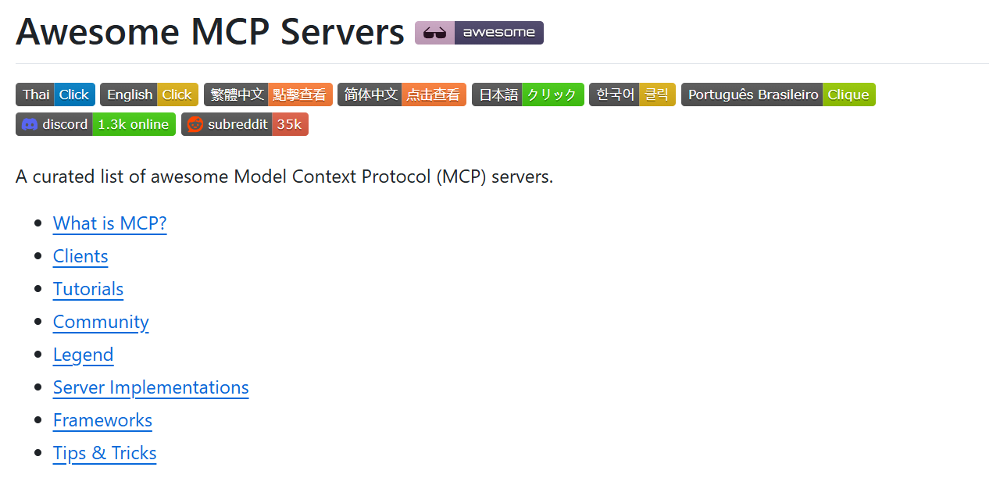awesome-mcp-servers 收集了 MCP 相关的服务端实现，项目按功能领域分为 30+ 类别，每个类别下列举相关 MCP 服务端：

- 🔗 连接器/聚合工具（Aggregators）
- 🎨 艺术与人文（Art & Culture）
- 📂 浏览器自动化（Browser Automation）
- ☁️ 云服务平台（Cloud Platforms）
- 👨‍💻 代码执行环境（Code Execution）
- 🤖 编程智能体（Coding Agents）
- 🖥️ 命令行工具（Command Line）
- 💬 通信服务（Communication）
- 👤 客户数据平台（Customer Data Platforms）
- 🗄️ 数据库系统（Databases）
- 📊 数据平台（Data Platforms）
- 🚚 物流与交付（Delivery）
- 🛠️ 开发者工具（Developer Tools）
- 🧮 数据科学工具（Data Science Tools）
- 📟 嵌入式系统（Embedded system）
- 📂 文件系统（File Systems）
- 💰 金融与金融科技（Finance & Fintech）
- 🎮 游戏开发（Gaming）
- 🧠 知识库与记忆存储（Knowledge & Memory）
- 🗺️ 位置服务（Location Services）
- 🎯 营销工具（Marketing）
- 📊 系统监控（Monitoring）
- 🎥 多媒体处理（Multimedia Process）
- 🔎 搜索与数据抽取（Search & Data Extraction）
- 🔒 安全工具（Security）
- 🌐 社交媒体集成（Social Media）
- 🏃 体育数据（Sports）
- 🎧 支持与服务管理（Support & Service Management）
- 🌎 翻译服务（Translation Services）
- 🎧 文本转语音（Text-to-Speech）
- 🚆 交通与出行（Travel & Transportation）
- 🔄 版本控制系统（Version Control）
- 🛠️ 其他工具与集成（Other Tools and Integrations）

以数据库为例，项目列举了支持多种数据库类型，具有数据访问、向量检索、自然语言转 sql 查询等功能的 MCP 服务端实现：

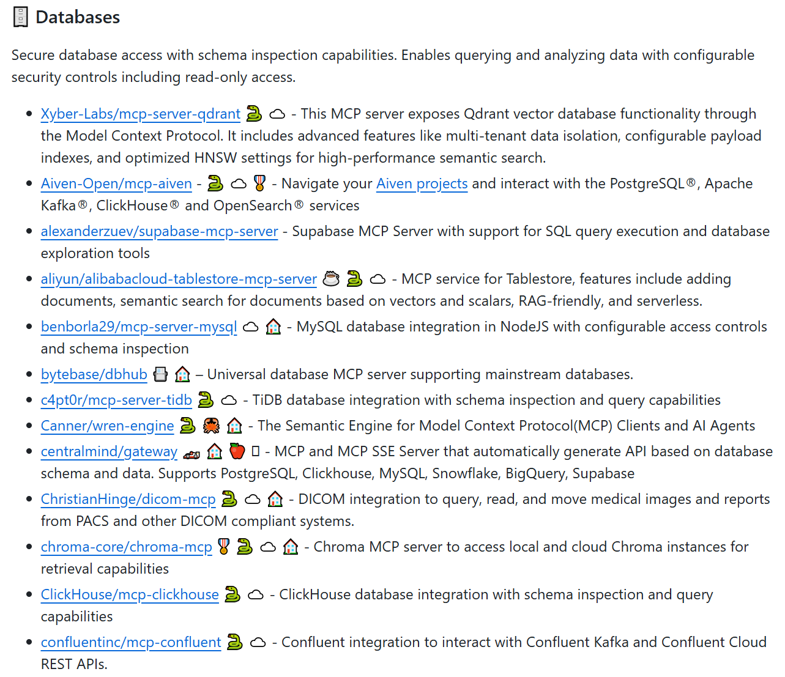


### 9.2 awesome-mcp-clients

项目地址：https://github.com/punkpeye/awesome-mcp-clients/

awesome-mcp-clients 收集和展示支持 MCP 协议的客户端，涵盖了从桌面应用到 Web 应用、命令行工具、IDE 插件等多种形态的客户端（商业闭源客户端，如 Claude Desktop；开源客户端，如 Cherry Studio）。MCP 客户端通过利用 MCP 服务端的功能，为大模型 LLM 提供了扩展能力，使其能够：

- 访问文件系统
- 连接数据库
- 集成外部 API
- 使用其他上下文服务（如代码执行、网络搜索等）

项目列举了 40+ 个 MCP 客户端实现，开发者和终端用户可以比较不同的客户端，选择最适合自己需求和环境的客户端。


## 第十章 MCP 协议重大更新（2025-06-18）：功能增强，安全升级！


MCP 于 2025-06-18 发布了重要版本更新。本次协议升级，推动MCP成为更安全、更智能的协作协议。

本章从**协议内容规范、功能增强、安全升级**三方面介绍本次协议更新的内容。

吴恩达将 MCP 协议定位为“**早期但极具潜力**”的技术标准。**由此可见，MCP 协议目前处于持续迭代演进阶段。**


### 10.1 协议内容规范与简化

#### 10.1.1 移除 JSON-RPC 批处理支持

***移除对 JSON-RPC 批处理支持，简化协议复杂度，提升单请求可靠性***。

- 原批处理机制：旧版MCP支持JSON-RPC 2.0批处理（Batching），允许客户端通过单次HTTP请求发送多个操作
- 新规范要求：所有操作必须单独发送，每个请求独立成单个JSON对象

移除 JSON-RPC 批处理支持的好处：

1. 降低客户端/服务端开发成本
2. 原生适配Streamable HTTP
3. 提升可观测性与调试效率
4. 依赖HTTP/2多路复用与异步IO，更灵活的并发控制

#### 10.1.2 版本协商机制

***强制版本标识与严格校验，为协议持续迭代提供了基础保障***。

1. 客户端请求必须携带协商版本号（如，MCP-Protocol-Version: 2025-06-18），确保功能与安全策略精准匹配
2. 旧版协议的客户端无版本头部，默认按2025-06-18处理。平滑过渡，减少兼容性负担
3. 版本号无效/不支持，立即返回400，拒绝处理。防止因版本混淆引发未定义行为

#### 10.1.3 明确生命周期操作要求（从should到must）

明确了 MCP 生命周期各阶段，必须遵循的协议内容：https://modelcontextprotocol.io/specification/2025-06-18/basic/lifecycle#operation

1. 初始化阶段：客户端必须发送 initialize请求，服务器必须响应能力信息
2. 操作阶段：服务端与客户端双方必须遵守协商的版本和能力
3. 关闭阶段：优雅终止连接。无需定义专门的关闭消息，依赖传输层机制（如 HTTP 断开连接/stdio 关闭流）关闭


### 10.2 功能增强

#### 10.2.1 结构化工具输出

***工具输出支持返回复杂数据结构而不仅是文本***

工具（Tools）调用经常需要返回结构化数据（如数据库查询结果、API 响应），但早期 MCP 仅支持简单文本输出（content 字段）。这导致：

- 复杂数据需序列化为文本，丢失结构信息
- LLM 难以可靠解析嵌套数据
- 客户端需二次解析，增加开发负担

因此，工具输出需要支持复杂数据结构，定义结构化结果的类型和结构，用于验证和数据说明

**输出模式**

- 字段 structuredContent：工具结果中返回结构化数据的字段，值为JSON对象。
- 向后兼容要求：工具返回结构化内容时，应同时提供功能等价的非结构化内容（在content 字段返回序列化的JSON字符串）
- 服务端：若工具声明了outputSchema，则服务端必须返回符合该模式的结构化结果
- 客户端：客户端应验证结构化结果是否符合输出模式

**工具定义示例（含输入/输出模式）**

```json
{
	"name": "get_weather_data",
	"title": "Weather Data Retriever",
	"description": "Get current weather data for a location",
	"inputSchema": {
		"type": "object",
		"properties": {
			"location": {
				"type": "string",
				"description": "City name or zip code"
			}
		},
		"required": [
			"location"
		]
	},
	"outputSchema": {
		"type": "object",
		"properties": {
			"temperature": {
				"type": "number",
				"description": "Temperature in celsius"
			},
			"conditions": {
				"type": "string",
				"description": "Weather conditions description"
			},
			"humidity": {
				"type": "number",
				"description": "Humidity percentage"
			}
		},
		"required": [
			"temperature",
			"conditions",
			"humidity"
		]
	}
}
```

**工具输出示例**

```json
{
	"jsonrpc": "2.0",
	"id": 5,
	"result": {
		"content": [
			{
				"type": "text",
				"text": "{\"temperature\": 22.5, \"conditions\": \"Partly cloudy\", \"humidity\": 65}"
			}
		],
		"structuredContent": {
			"temperature": 22.5,
			"conditions": "Partly cloudy",
			"humidity": 65
		}
	}
}
```

**结构化工具输出的好处**

- ✅ 支持对响应进行严格的模式校验
- 💡 提供类型信息以更好地与编程语言集成
- 🧭 引导客户端和LLM正确解析并利用返回的数据
- 📚 支持更好的文档和开发者体验

#### 10.2.2 征询机制（Elicitation）

***新增对信息征询机制（Elicitation）的支持，允许服务器在交互过程中动态向用户请求额外信息，解决参数缺失或需动态配置的场景***（如身份验证补充、参数澄清）

具体流程：

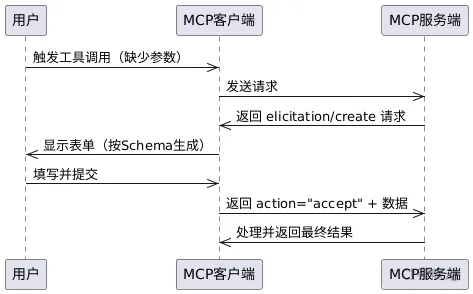

**Elicitation 是 MCP 实现 Human-in-the-loop（人机交互） 的关键机制，使服务器能打破被动响应模式，主动介入交互流程**。


#### 10.2.3 资源链接支持

***工具调用结果可包含资源 uri 引用，以提供额外的上下文或数据***（工具将返回一个可供客户端订阅或获取的 uri）

含资源 uri 的响应示例：

```json
{
  "type": "resource_link",
  "uri": "file:///project/src/main.rs",
  "name": "main.rs",
  "description": "Primary application entry point",
  "mimeType": "text/x-rust"
}
```


### 10.3 安全升级

#### 10.3.1 OAuth 资源服务器

***明确MCP服务作为OAuth资源服务器的角色，增加授权服务器元数据***

**授权服务器位置声明机制**

MCP服务器必须实现OAuth 2.0受保护资源元数据规范（RFC9728），以声明其关联的授权服务器位置。MCP服务器返回的元数据文档必须包含authorization_servers字段，且该字段需至少列出一个授权服务器地址。

- 关键要求：当返回HTTP 401 Unauthorized响应时，MCP服务器必须在WWW-Authenticate头部中声明资源服务器元数据URL
- 客户端责任：MCP客户端必须能解析WWW-Authenticate头部，并正确处理来自MCP服务器的401响应

**服务器元数据发现机制**

MCP客户端必须遵循OAuth 2.0授权服务器元数据规范（RFC8414），获取与授权服务器交互所需的端点信息（如令牌颁发、授权端点等）。

#### 10.3.2 资源指示器强制要求

***要求 MCP 客户端必须实现 RFC 8707 定义的资源指示符（Resource Indicators）机制，以防止恶意服务器获取不当的访问令牌，从而避免越权访问***。

**问题背景**

客户端获取的访问令牌（Access Token）可能被恶意服务器诱导使用。例如，一个钓鱼 MCP 服务器可诱骗客户端发送本应提供给其他服务的令牌，从而越权访问用户数据。

**解决方案**

通过 RFC 8707 资源指示符（Resource Indicators），强制客户端在申请令牌时声明其目标资源（如 https://api.valid-mcp.com），使令牌仅对该资源有效。恶意服务器无法利用此令牌访问其他系统。

**安全价值**

- 最小权限原则：将令牌权限收缩至单一资源，避免“一牌多用”风险。
- 协议兼容性：基于 OAuth 2.1 标准扩展

#### 10.3.3 安全规范与最佳实践

**安全规范**

1. 通过 PKCE、HTTPS、RFC 8707 资源绑定、令牌校验等机制，阻断令牌劫持与越权
2. 最小权限：短期令牌 + 资源绑定，将攻击影响限制在单一服务内
3. 协议演进：OAuth 2.1 与 RFC 8707 的强制整合，标志 MCP 从“功能优先”转向“安全优先”

**安全最佳实践**

https://modelcontextprotocol.io/specification/2025-06-18/basic/security_best_practices

1. 授权链可信：通过动态客户端的用户双重确认，阻断混淆代理攻击；
2. 令牌边界隔离：严禁令牌透传，强制受众验证，实现资源级零信任访问；
3. 会话可溯源：会话ID与用户身份强绑定，消除劫持与注入风险。


### 10.4 其他变更

1. 元数据扩展：新增_meta字段：支持接口类型扩展元数据。
2. 上下文传递优化：CompletionRequest增加context字段：允许携带已解析变量。
3. 命名规范升级：新增title字段，name作为程序标识符，title提供人性化显示名称。

